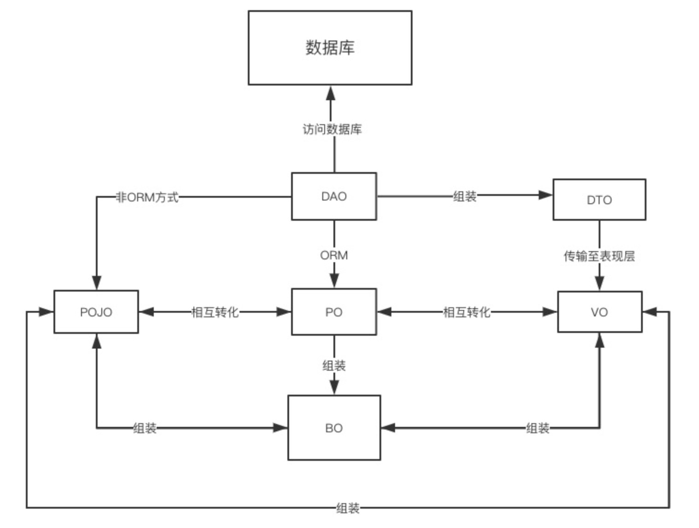

# java对象

## DAO（Data Access Object）数据访问对象
DAO 是一个面向对象的数据库接口，负责持久层的操作，为业务层提供接口，主要用来封装对数据库的访问及各种及各种操作，如 CURD
DAO 位于业务逻辑与数据库资源中间，可以结合 PO 对数据库进行相关的操作。

## PO（Persistent Object）持久层对象：保存到数据库or缓存
PO 是由一组属性和属性的 get 和 set 方法组成，可以看做是与数据库中表相映射的 java 对象
最简单的 PO 是对应数据库中某个表中的一条记录（即可以将表中的一条记录理解为一个持久层对象），多个记录可以用 PO 的集合
PO 仅包含数据，不包含任何对数据库的操作，PO 的属性是跟数据库表的字段一一对应的，此外 PO 对象需要实现序列化接口。

## BO（Business Object）业务层对象
BO 是对真实世界的简单抽象，主要作用是把业务逻辑封装为一个对象，这个对象可以包括一个或多个其它的对象。
BO 是封装业务逻辑的 java 对象, 通过调用 DAO 方法, 结合 PO,VO 进行业务操作。
例：一份简历有教育经历、工作经历、社会关系等属性。则简历就是 BO，教育经历对应一个 PO、工作经历对应一个 PO、社会关系对应一个 PO，这样每个简历 BO 都包括三个 PO，在处理业务逻辑时，可以针对 BO 去处理

## DO（Domain Object）领域对象
DO 是从现实世界中抽象出的业务实体，一般还包含 ORM 映射

## VO（Value Object）值对象：用于前端展示，放置到JSP中解析或者给前端传递数据
VO 通常用于业务层之间的数据传递，仅包含数据。VO 应该是抽象出的业务对象，可以和表对应，也可以不对应，根据业务需要确定。
用 new 关键字创建，由 GC 回收的

## DTO（Data Transfer Object）数据传输对象：用于接口互相调用返回,数据传输，如很多接口调用返回值或消息队列内容
DTO 泛指用于展示层与服务层之间的数据传输对象。
使用 DTO 的优势：
1. 避免传递过多的无用数据，提高数据的传输速度；如一个 PO 就有 25 个属性，但页面上只需要显示 5 个字段，因此没有必要把整个 PO 对象传递给客户端，此时可以只将仅有 5 个属性的 DTO 把结果传递给客户端即可，如果用这个对象来对应界面的显示对象，那此时它的身份就转为 VO
2. 隐藏后端的表结构。常见用法：将请求的数据或属性组装成一个 RequestDTO，再将响应的数据或属性组装成一个 ResponseDTO。

## TO(Transfer Object) 数据传输对象
TO 是不同应用程序之间传输的对象

## POJO(plain ordinary java object) 简单无规则 java 对象
POJO 是普通的 javabean，可以理解为简单的实体类，其中有一些属性及其 getter 和 setter 方法的类，没有业务逻辑，也不允许有业务方法，也不能携带有 connection 之类的方法。
即最基本的 Java Bean ，只有属性字段及 getter 和 setter 方法。
POJO是DO/DTO/BO/VO的统称。

## 实例分析
以一个实例来探讨下 POJO 的使用。假设我们有一个面试系统，数据库中存储了很多面试题，通过 web 和 API 提供服务。可能会做如下的设计：

数据表：表中的面试题包括编号、题目、选项、答案、创建时间、修改时间；
PO：包括题目、选项、答案、创建时间、修改时间；
VO：题目、选项、答案、上一题URL、下一题URL；
DTO：编号、题目、选项、答案、上一题编号、下一题编号；
DAO：数据库增删改查方法；
BO：业务基本操作。

可以看到，进行 POJO 划分后，我们得到了一个设计良好的架构，各层数据对象的修改完全可以控制在有限的范围内。

## 参考文档
https://juejin.cn/post/6844903907840245773
https://guobinhit.blog.csdn.net/article/details/77247427?utm_medium=distribute.pc_relevant.none-task-blog-BlogCommendFromMachineLearnPai2-3.control&depth_1-utm_source=distribute.pc_relevant.none-task-blog-BlogCommendFromMachineLearnPai2-3.control
