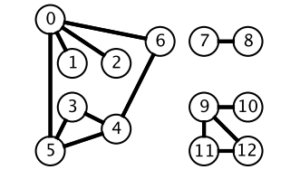

# 搜索

## BFS

BFS 广度优先搜索的搜索过程是一层一层地进行遍历，每层遍历都以上一层遍历的结果作为起点，遍历一个距离能访问到的所有节点。需要注意的是，遍历过的节点不能再次被遍历。  
  
第一层：  
0 -> {6,2,1,5};  
  
第二层：  
6 -> {4}  
2 -> {}  
1 -> {}  
5 -> {3}  
  
第三层：  
4 -> {}  
3 -> {}  
  
上述过程可知：是反复从新节点出发进行遍历操作。  
  
每一轮遍历的节点都与根节点路径长度相同。设 di 表示第 i 个节点与根节点的路径长度，可以推导出结论：对于先遍历的节点 i 与后遍历的节点 j，有 di<=dj。  
利用上述结论，可以求解最短路径  **最优解**  问题：第一次遍历到目的节点，其所经过的路径为最短路径，如果继续遍历，之后再遍历到目的节点，所经过的路径就不是最短路径。  
  
在程序实现 BFS 时需要考虑以下问题：
- 队列：用来存储每一轮遍历的节点。
- 标记：对于已经遍历的节点，需要标记，避免重复遍历。

## DFS

深度优先搜索在得到一个新节点时立马对新节点进行遍历：  
从节点 0 出发开始遍历，得到到新节点 6 时，立马对新节点 6 进行遍历，得到新节点 4；  
如此反复以这种方式遍历新节点，直到没有新节点了，此时返回。返回到根节点 0 的情况是，继续对根节点 0 进行遍历，得到新节点 2，然后继续以上步骤。  
  
从一个节点出发，使用 DFS 对一个图进行遍历时，能够遍历到的节点都是从初始节点可达的，DFS 常用来求解 **可达性** 问题。  
  
在程序实现 DFS 时需要考虑以下问题：  
- 栈：用来存储当前节点信息，当遍历新节点返回时能够继续遍历当前节点。也可以使用递归栈。
- 标记：对已经遍历过的节点进行标记。