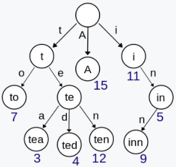

# 数据结构

<!-- GFM-TOC -->
* [栈与队列](#栈与队列)
    * [用栈实现队列](#用栈实现队列)
    * [用队列实现栈](#用队列实现栈)
    * [最小值栈](#最小值栈)
    * [用栈实现括号匹配](#用栈实现括号匹配)
* [哈希表](#哈希表)
    * [两数之和](#两数之和)
    * [同构字符串](#同构字符串)
    * [最长和谐序列](#最长和谐序列)
    * [无重复字符的最长子串](#无重复字符的最长子串)
* [二叉树](#二叉树)
    * [递归](#递归)
        * [二叉树的高度](#二叉树的高度)
        * [二叉树的最小高度](#二叉树的最小高度)
        * [反转二叉树](#反转二叉树)
        * [归并二叉树](#归并二叉树)
        * [路径和](#路径和)
        * [对称树](#对称树)
        * [平衡二叉树](#平衡二叉树)
        * [相同树](#相同树)
    * [遍历](#遍历)
        * [前序遍历](#前序遍历)
        * [中序遍历](#中序遍历)
        * [后序遍历](#后序遍历)
        * [层次遍历](#层次遍历)
            * [二叉树每层节点的平均值](#二叉树每层节点的平均值)
            * [得到左下角节点值](#得到左下角节点值)
    * [二叉查找树](#二叉查找树)
        * [有序数组构造二叉查找树](#有序数组构造二叉查找树)
        * [二叉查找树的最近公共祖先](#二叉查找树的最近公共祖先)
        * [二叉树的最近公共祖先](#二叉树的最近公共祖先)
        * [验证二叉查找树](#验证二叉查找树)
        * [二叉查找树中第k小的数](#二叉查找树中第k小的数)
    * [前缀树Trie](#前缀树trie)
* [数组与矩阵](#数组与矩阵)
    * [移动0到数组末尾](#移动0到数组末尾)
    * [找出数组中重复的数](#找出数组中重复的数)
    * [二维矩阵查找](#二维矩阵查找)
    * [有序矩阵的第k小元素](#有序矩阵的第k小元素)
    * [归并两个有序数组](#归并两个有序数组)
* [链表](#链表)
    * [两个链表的交点](#两个链表的交点)
    * [反转链表](#反转链表)
    * [归并两个有序链表](#归并两个有序链表)
    * [删除有序链表的重复节点](#删除有序链表的重复节点)
    * [快慢指针法](#快慢指针法)
    * [环形链表](#环形链表)
    * [回文链表](#回文链表)
    * [奇偶链表](#奇偶链表)
<!-- GFM-TOC -->

## 栈与队列

栈是一个只能从同一端插入或删除的线性表，是先进后出。插入删除端为栈顶，另一端为栈底。对于栈 [1, 2, 3, 4], 1 是栈底，4 是栈顶。  
队列是一个从一端插入，从另一端删除的线性表，是先进先出。插入端为队尾，删除端队头。对于队列 [4, 3, 2, 1], 1 是队尾，4 是队头。

### 用栈实现队列
[Leetcode : 232. Implement Queue using Stacks (Easy)](https://leetcode.com/problems/implement-queue-using-stacks/description/)

>Implement the following operations of a queue using stacks.  
push(x) -- Push element x to the back of queue.  
pop() -- Removes the element from in front of queue.  
peek() -- Get the front element.  
empty() -- Return whether the queue is empty.  
>  
>Notes:  
You must use only standard operations of a stack -- which means only push to top, peek/pop from top, size, and is empty operations are valid.  
Depending on your language, stack may not be supported natively. You may simulate a stack by using a list or deque (double-ended queue), as long as you use only standard operations of a stack.  
You may assume that all operations are valid (for example, no pop or peek operations will be called on an empty queue).

问题描述：用栈来实现队列，假设队列 q = [1, 2, 3, 4]，那么其在栈里面的顺序是 s = [4, 3, 2, 1]。push() 要在队列 q 的队尾增加一个元素， 则在栈 s 中应该在栈顶增加一个元素，变为 s = [x, 4, 3, 2, 1]，可以使用两个栈来实现，一个只进行入栈 push 操作，一个只进行出栈 pop 操作，因此只需要在 instack 中追加元素 x 即可实现；pop() 删除队头元素 1，而在栈 s 中 1 是先进后出，因此可以将其全部 push 到 outstack 中，再取出栈顶元素即可。  
  
push() 时间复杂度 o(1)  
pop(), peek() 时间复杂度 o(n)

```python
class MyQueue:
    def __init__(self):
        self.instack, self.outstack = [],[]

    def push(self, x):
        self.instack.append(x)

    def pop(self):
        self.in2out()
        self.outstack.pop()
        
    def peek(self):
        self.in2out()
        return self.outstack[-1]
        
    def empty(self):
        return not self.instack and not self.outstack
    
    def in2out(self):
        if not self.outstack:
            while self.instack:
                self.outstack.append(self.instack.pop())
```

### 用队列实现栈
[Leetcode : 225. Implement Stack using Queues (Easy)](https://leetcode.com/problems/implement-stack-using-queues/description/)

```python
class MyStack:
    def __init__(self):
        self.queue = [] 

    def push(self, x):
        self.queue.append(x)

    def pop(self):
        for i in range(len(self.queue) - 1):
            self.queue.append(self.queue.pop(0))
        return self.queue.pop(0)

    def top(self):
        for i in range(len(self.queue) - 1):
            self.queue.append(self.queue.pop(0))
        result = self.queue[0]
        self.queue.append(self.queue.pop(0)) # 恢复原样
        return result

    def empty(self):
        return not self.queue
```

### 最小值栈
[Leetcode : 155. Min Stack (Easy)](https://leetcode.com/problems/min-stack/description/)

>Design a stack that supports push, pop, top, and retrieving the minimum element in constant time.  
push(x) -- Push element x onto stack.  
pop() -- Removes the element on top of the stack.  
top() -- Get the top element.  
getMin() -- Retrieve the minimum element in the stack.  

问题描述：题目要求得到最小值的时间复杂度为 o(1)，因此需要以空间换时间，可以使用两个栈来实现，一个栈存储原始数据，另一个栈存储最小值。

```python
class MinStack:
    def __init__(self):
        self.stack, self.minstack = [], []

    def push(self, x):
        self.stack.append(x)
        if not self.minstack or x <= self.minstack[-1]:  #1
            self.minstack.append(x)
        
    def pop(self):
        if self.minstack and self.minstack[-1] == self.top():
            self.minstack.pop()
        self.stack.pop()

    def top(self):
        return self.stack[-1]
       
    def getMin(self):
        return self.minstack[-1]
```

备注： 1. 必须要是 x <= self.minstack[-1]，重复元素也应该加到 minstack 中，否则在删除时会删除唯一的 min 值。

### 用栈实现括号匹配
[Leetcode : 20. Valid Parentheses (Easy)](https://leetcode.com/problems/valid-parentheses/description/)

>Given a string containing just the characters '(', ')', '{', '}', '[' and ']', determine if the input string is valid.  
The brackets must close in the correct order, "()" and "()[]{}" are all valid but "(]" and "([)]" are not.

思路：栈最典型的应用即验证配对情况，对一个有效的括号对，左括号必定在右括号前面，因此可以将所有的左括号入栈，遇到匹配的右括号就将栈顶的括号消除，必定会有至少一对括号在 s 中是相邻的，因此一直消除栈顶，如果遇到不匹配的括号，直接返回 False，但栈为空时，即没有左括号，此时仍有右括号，则返回 False，最后所有字符都遍历完成后，栈为空则返回 True， 栈非空返回 Flase。  
  
可以利用 dict 来存储括号对，从而提高代码效率。  
  
时间复杂度为 o(n), 空间复杂度为 o(n)。

```python
def is_valid(s):
    stack = []
    dict = {'(': ')', '[': ']', '{': '}'}
    for c in s:
        if c in dict:
            stack.append(c)
        elif len(stack) == 0 or dict[stack.pop()] != c:
            return False
    return not stack
```

## 哈希表
python 的内建数据类型字典是用哈希表来实现的，使用哈希表可以快速查找一个元素是否存在，但需要一定的存储空间。因此在优先考虑时间复杂度的情况下，可以使用哈希表来以空间换时间。  
  
>**字典 dict 的遍历**  
遍历 key 值：for key in dict  
遍历 value 值：for value in dict.values()  
遍历字典项：for kv in dict.items()  
遍历 key 和 value 值 : for key, value in dict.items()  
>  
>dict.get(key) : 返回指定键的值，不存在则返回 None  
dict.has_key(key) : 键在字典中返回 true，否则 false  
dict.pop(key) ：删除该 key 和 value

### 两数之和
[Leetcode : 1. Two Sum (Easy)](https://leetcode.com/problems/two-sum/description/)

>Given an array of integers, return indices of the two numbers such that they add up to a specific target.  
You may assume that each input would have exactly one solution, and you may not use the same element twice.  
>  
>Example:  
Given nums = [2, 7, 11, 15], target = 9,  
Because nums[0] + nums[1] = 2 + 7 = 9,
return [0, 1].

思路：使用字典来存储数组元素和索引的映射，将 nums[i] 和 i 存储到 dict 中，遍历一遍数组，若 target - nums[i] 在 dict 中，则直接返回两个数的下标。  
  
时间复杂度为 o(n)，空间复杂度为 o(n)

```python
def twoSum(nums, target):
    dic = {}
    if len(nums) <= 1:
        return false
    for i in range(len(nums)):
        tmp = target - nums[i]
        if tmp in dic:
            return [dic[tmp], i]
        else:
            dic[nums[i]] = i
```

### 同构字符串
[Leetcode : 205. Isomorphic Strings (Easy)](https://leetcode.com/problems/isomorphic-strings/description/)

>Given two strings s and t, determine if they are isomorphic.  
Two strings are isomorphic if the characters in s can be replaced to get t.  
All occurrences of a character must be replaced with another character while preserving the order of characters. No two characters may map to the same character but a character may map to itself.  
>  
>For example,  
Given "egg", "add", return true.  
Given "foo", "bar", return false.  
Given "paper", "title", return true.  
Note:  
You may assume both s and t have the same length.  

问题描述：判断两个字符串是否是同构字符串，如果一个字符串 s 中的字符可以替换成别的字符，从而得到另一个字符串 t，则 s 和 t 是同构字符串。并且 s 中的所有相同字符都要被替换，保持原来的顺序，两个不同的字符不可以替换成相同的字符，字符也可以不替换。  
  
思路：用字典来存储 s[i] 和 t[i]，将第一个字符串 s 的字符作为 key，第二个字符串 t 的字符作为 value，遍历一遍数组，有两种情况：  
1. 当 s[i] 在 dic 中时，s[i] 的 value 不等于 t[i] 时，则直接返回 False，相等则继续遍历。  
2. 当 s[i] 不在 dic 中时，若此时对应的 t[i] 却在 dic 的 values 中，则表明已经有一个 key 对应了这个 t[i]，现在 s[i] 对应的字符也是 t[i]，由于不能有两个不同的字符对应同一个字符，因此返回 False；否则将这一对 s[i] 作为 key，t[i] 作为 value 存入 dic 中。

```python
def isIsomorphic(self, s, t):
    dic = {}
    for i in range(len(s)):
        if s[i] in dic:
            if t[i] != dic[s[i]]:
                return False 
        else:
            if t[i] in dic.values():
                return False
            dic[s[i]] = t[i]
    return True
```

### 最长和谐序列
[Leetcode : 594. Longest Harmonious Subsequence (Easy)](https://leetcode.com/problems/longest-harmonious-subsequence/description/)

>We define a harmonious array is an array where the difference between its maximum value and its minimum value is exactly 1.  
Now, given an integer array, you need to find the length of its longest harmonious subsequence among all its possible subsequences.  
>  
>Input: [1,3,2,2,5,2,3,7]  
Output: 5  
Explanation: The longest harmonious subsequence is [3,2,2,2,3].  
Note: The length of the input array will not exceed 20,000.  

问题描述：找出数组中的最长和谐序列，其最大数和最小数之间只相差 1。  
  
思路：在最长和谐序列中，只可能出现两种数字，这两个数字之间相差 1，因此可以先对 nums 进行计数，得到 nums[i]：count[i] 的一个字典，遍历该字典，对每个 key 判断 key+1 是否在其中，并返回次数和的最大值。

```python
def find_LHS(nums):
    dict = collections.Counter(nums)
    output = 0
    for key in dict:
        if key + 1 in dict:
           output = max(output, dict[key] + dict[key+1])
    return output
```

>备注：python 标准库 collections 模块中的 Counter 类，用于跟踪值出现的次数，以字典的键对值形式进行存储，元素作为 key，其计数作为 value。

### 无重复字符的最长子串
[Leetcode : 3. Longest Substring Without Repeating Characters(Medium)](https://leetcode.com/problems/longest-substring-without-repeating-characters/description/)

>Given a string, find the length of the longest substring without repeating characters.  
Given "abcabcbb", the answer is "abc", which the length is 3.  
Given "bbbbb", the answer is "b", with the length of 1.  
Given "pwwkew", the answer is "wke", with the length of 3. Note that the answer must be a substring, "pwke" is a subsequence and not a substring.

思路：使用哈希表来记录字符及其位置，当遇到重复字符时，应该从该字符的下一个字符开始重新计数，并且更新该字符在哈希表中的位置值。记录计数的起始位置为 start，当前字符位置为 i，则子串的长度为 i-start+1，不断更新最大长度得到最终结果。  
  
注意：start <= dict[s[i]] 也就是要小于等于重复字符的上一个位置市才重新开始计数，否则就加上该字符。  
  
时间复杂度为 o(n), 空间复杂度为 o(1)

```python
class Solution(object):
    def lengthOfLongestSubstring(self, s):
        maxlength = start = 0
        dict = {}
        for i in range(len(s)):
            if s[i] in dict and start <= dict[s[i]]:
                start = dict[s[i]] + 1
            else:
                maxlength = max(maxlength, i-start+1)
            dict[s[i]] = i
        return maxlength
```

## 数组与矩阵

## 二叉树
二叉树（Binary Tree）是 n 个节点的有限集合，该集合可以为空集（称为空二叉树），或者由一个根节点和两棵互不相交的、分别称为根节点的左子树和右子树的二叉树组成。 
  
### 递归
二叉树是一种递归结构，很多问题可以使用递归解决。  
  
下面各题中对于二叉树的定义：
```python
# Definition for a binary tree node.
class TreeNode:
    def __init__(self, x):
        self.val = x
        self.left = None
        self.right = None
```

#### 二叉树的高度
[Leetcode : 104. Maximum Depth of Binary Tree (Easy)](https://leetcode.com/problems/maximum-depth-of-binary-tree/description/)

>Given a binary tree, find its maximum depth.  
The maximum depth is the number of nodes along the longest path from the root node down to the farthest leaf node.

问题描述： 求二叉树的高度，利用递归计算，返回左子树和右子树中较大的深度，再加上 1 作为原二叉树的深度。  
  
时间复杂度为 o(n)

```python
class Solution:
    def maxDepth(self, root):
        if not root:
            return 0
        return max(self.maxDepth(root.left), self.maxDepth(root.right)) + 1
```

#### 二叉树的最小高度
[Leetcode : 111. Minimum Depth of Binary Tree (Easy)](https://leetcode.com/problems/minimum-depth-of-binary-tree/description/)

>Given a binary tree, find its minimum depth.  
The minimum depth is the number of nodes along the shortest path from the root node down to the nearest leaf node.

思路：简单思考有四种情况
1. 空树，返回 0
2. 只有右子树，返回右子树高度
3. 只有左子树，返回左子树高度
4. 左右子树都有，返回左右子树高度的较小值

```python
class Solution:
    def minDepth(self, root):
        if not root:
            return 0
        if not root.left and root.right:
            return self.minDepth(root.right) + 1
        if not root.right and root.left:
            return self.minDepth(root.left) + 1
        return min(self.minDepth(root.left), self.minDepth(root.right)) + 1
```

#### 反转二叉树
[Leetcode : 226. Invert Binary Tree (Easy)](https://leetcode.com/problems/invert-binary-tree/description/)

```html
Invert a binary tree.  
     4  
   /   \  
  2     7  
 / \   / \  
1   3 6   9  
to  
     4  
   /   \  
  7     2  
 / \   / \  
9   6 3   1
```

思路：反转二叉树，对于一个节点 root 而言，只需要将其左孩子和右孩子交换即可实现反转，递归调用即可。

```python
class Solution:
    def invertTree(self, root):
        if not root:
            return None
        root.left, root.right = root.right, root.left

        self.invertTree(root.left)
        self.invertTree(root.right)        
        return root
```

#### 归并二叉树
[Leetcode : 617. Merge Two Binary Trees (Easy)](https://leetcode.com/problems/merge-two-binary-trees/description/)

>Given two binary trees and imagine that when you put one of them to cover the other, some nodes of the two trees are overlapped while the others are not.  
You need to merge them into a new binary tree. The merge rule is that if two nodes overlap, then sum node values up as the new value of the merged node. Otherwise, the NOT null node will be used as the node of new tree.  

```html
Input:  
    Tree 1                     Tree 2  
          1                         2  
         / \                       / \  
        3   2                     1   3  
       /                           \   \  
      5                             4   7  
Output:  
Merged tree:  
         3  
        / \  
       4   5  
      / \   \  
     5   4   7
```

思路：
```python
def mergeTrees(self, t1, t2):
    if not t1 and not t2:
        return None
    if not t1:
        return t2
    if not t2:
        return t1
    root = TreeNode(t1.val + t2.val)
    root.left = self.mergeTrees(t1.left, t2.left)
    root.right = self.mergeTrees(t1.right, t2.right)
        
    return root
```

#### 路径和
[Leetcdoe : 112. Path Sum (Easy)](https://leetcode.com/problems/path-sum/description/)

>Given a binary tree and a sum, determine if the tree has a root-to-leaf path such that adding up all the values along the path equals the given sum.  
```html
Given the below binary tree and sum = 22,
      5
     / \
    4   8
   /   / \
  11  13  4
 /  \      \
7    2      1
return true, as there exist a root-to-leaf path 5->4->11->2 which sum is 22.
```

思路：利用递归实现，如果根节点为空，则直接返回 False，如果到最后都没有出现 sum == 0 的情况时，再进行一轮递归，则 root == None， 因此也返回 False。必须要注意的是最后的返回一定是递归的结果，当 sum == 0 并且该节点为叶子节点时才返回 True。

```python
class Solution:
    def hasPathSum(self, root, sum):
        if not root:
            return False
        sum -= root.val
        if sum == 0 and not root.left and not root.right:
            return True
        return self.hasPathSum(root.left, sum) or self.hasPathSum(root.right, sum)
```

#### 对称树
[Leetcode : 101. Symmetric Tree (Easy)](https://leetcode.com/problems/symmetric-tree/description/)

```html
Given a binary tree, check whether it is a mirror of itself (ie, symmetric around its center).

For example, this binary tree [1,2,2,3,4,4,3] is symmetric:
    1
   / \
  2   2
 / \ / \
3  4 4  3
```

思路： 由于输入只有 root，而判断对称树需要比较左右节点是否相等，因此可以构造一个辅助函数 symmetric 来比较左右节点的值。  
1. 终止条件是已经到了叶子节点，即 left == None and right == None  
2. 当左右节点的值相等时，继续递归比较左节点的左子树与右节点的右子树是否相等，以及左节点的右子树与右节点的左子树是否相等。

```python
class Solution:
    def isSymmetric(self, root):
        if not root:
            return True # 空树为对称树
        return self.symmetric(root.left, root.right)
         
    def symmetric(self, left, right):
        if not left and not right:
            return True
        if left and right and left.val == right.val:
            return self.symmetric(left.left, right.right) and self.symmetric(left.right, right.left)
        else:
            return False
```

#### 平衡二叉树
[Leetcode : 110. Balanced Binary Tree (Easy)](https://leetcode.com/problems/balanced-binary-tree/description/)

>Given a binary tree, determine if it is height-balanced.  
For this problem, a height-balanced binary tree is defined as:  
a binary tree in which the depth of the two subtrees of every node never differ by more than 1.

```html
Given the following tree [3,9,20,null,null,15,7]:
    3
   / \
  9  20
    /  \
   15   7
Return true.

Given the following tree [1,2,2,3,3,null,null,4,4]:
       1
      / \
     2   2
    / \
   3   3
  / \
 4   4
Return false.
```

思路：平衡二叉树是二叉树的任意节点的两颗子树之间的高度差小于等于 1。对于平衡二叉树，其左子树和右子树也是平衡二叉树，因此可以递归判断。需要构造一个函数来求二叉树的高度，可以用之前的 maxDepth。  
1. 终止条件：当左子树和右子树的最大高度相差 1 时，返回 False  
2. 继续递归调用 isBalanced, 判断 root.left 和 root.right 是不是平衡二叉树。

```python
class Solution:
    def isBalanced(self, root):
        if not root:
            return True
        if abs(self.maxDepth(root.left) - self.maxDepth(root.right)) > 1:
            return False
        return self.isBalanced(root.left) and self.isBalanced(root.right)
        
    def maxDepth(self, root):
        if not root:
            return 0
        return max(self.maxDepth(root.left), self.maxDepth(root.right)) + 1
```

#### 相同树
[Leetcode : 100. Same Tree (Easy)](https://leetcode.com/problems/same-tree/description/)

>Given two binary trees, write a function to check if they are the same or not.  
Two binary trees are considered the same if they are structurally identical and the nodes have the same value.

```python
class Solution(object):
    def isSameTree(self, p, q):
        if (not p and q) or (not q and p):
            return False
        if not p and not q:
            return True
        return p.val == q.val and self.isSameTree(p.left, q.left) and self.isSameTree(p.right, q.right)
```

### 遍历
```html
    1
   / \
  2   3
 / \   \
4   5   6
```
1. 层次遍历，[1, 2, 3, 4, 5, 6]
2. 前序遍历（根左右），[1, 2, 4, 5, 3, 6]
3. 中序遍历（左根右），[4, 2, 5, 1, 3, 6]
4. 后序遍历（左右根），[4, 5, 2, 6, 3, 1]  
层次遍历使用 **广度优先搜索 BFS** 实现，  
前中后序遍历使用 **深度优先搜索 DFS** 实现。

#### 前序遍历
[Leetcode : 144. Binary Tree Preorder Traversal (Medium)](https://leetcode.com/problems/binary-tree-preorder-traversal/description/)

>Given a binary tree, return the inorder traversal of its nodes' values.

递归实现
```python
class Solution(object):
    def __init__(self):
        self.result = []
    def preorderTraversal(self, root):
        """
        :type root: TreeNode
        :rtype: List[int]
        """
        if root:
            self.result.append(root.val)
            self.preorderTraversal(root.left)
            self.preorderTraversal(root.right)
        return self.result
```
  
非递归实现：  
利用堆栈，用迭代来实现二叉树的前序遍历，一直将左子树进栈，root->left->right
1. 当根节点存在时，保存根节点的值，并将根节点入栈
2. 将根节点指向左子树
3. 当根节点不存在时（即没有左子树），栈顶元素出栈，并将根节点指向栈顶元素的右子树
4. 循环 123 步

>总结：  
非空：访问，进栈，向左走  
空：出栈，向右走

```python
class Solution(object):
    def preorderTraversal(self, root):
        result = []
        stack = []
        while root or stack:
            while root:
                result.append(root.val)
                stack.append(root)
                root = root.left
            if stack:
                node = stack.pop()
                root = node.right
        return result
```

#### 中序遍历
[Leetcode : 94. Binary Tree Inorder Traversal (Medium)](https://leetcode.com/problems/binary-tree-inorder-traversal/description/)

非递归实现：  
中序遍历同样利用堆栈实现，堆栈定义与前序遍历相同。left->root->right
1. 当根节点存在时，将根节点入栈，并将根节点指向左子树
2. 当根节点不存在时（即没有左子树），栈顶元素出栈，保存栈顶元素的值（第一次即最左节点），并将根节点指向栈顶元素的右子树

```python
class Solution(object):
    def inorderTraversal(self, root):
        result = []
        stack = []
        while root or stack:
            while root:
                stack.append(root)
                root = root.left
            if stack:
                node = stack.pop()
                result.append(node.val)
                root = node.right
        return result
```

#### 后序遍历
[Leetcode : 145. Binary Tree Postorder Traversal (Hard)](https://leetcode.com/problems/binary-tree-postorder-traversal/description/)

非递归实现：  
后序遍历同样利用堆栈实现，left->right->root，可以通过 root->right->left 的结果逆序输出得到，即与前序遍历相似

```python
class Solution(object):
    def postorderTraversal(self, root):
        result = []
        stack = []
        while root or stack:
            while root:
                result.append(root.val)
                stack.append(root)
                root = root.right
            if stack:
                node = stack.pop()
                root = node.left
        return result[::-1]
```

#### 层次遍历
[Leetcode : 102. Binary Tree Level Order Traversal (Medium)](https://leetcode.com/problems/binary-tree-level-order-traversal/description/)

```html
Given a binary tree, return the level order traversal of its nodes' values. (ie, from left to right, level by level).

For example:
Given binary tree [3,9,20,null,null,15,7],
    3
   / \
  9  20
    /  \
   15   7
return its level order traversal as:
[
  [3],
  [9,20],
  [15,7]
]
```

思路：层次遍历利用队列的先进先出特性，将先进入队列的元素 pop 出来。  
题中需要按照层次来打印出遍历结果，可以用一个临时列表存储二叉树一层的所有节点。即用 queue 来存储当前层元素， tmp 存储下一层元素。

```python
class Solution(object):
    def levelOrder(self, root):
        result = []
        if not root:
            return result
        queue = [root]
        while queue:
            result.append([node.val for node in queue])
            tmp = []
            for node in queue:
                if node.left:
                    tmp.append(node.left)
                if node.right:
                    tmp.append(node.right)
            queue = tmp
        return result
```

#### 二叉树每层节点的平均值
[637. Average of Levels in Binary Tree (Easy)](https://leetcode.com/problems/average-of-levels-in-binary-tree/description/)

>Given a non-empty binary tree, return the average value of the nodes on each level in the form of an array.

```html
Input:
    3
   / \
  9  20
    /  \
   15   7
Output: [3, 14.5, 11]
Explanation:
The average value of nodes on level 0 is 3,  on level 1 is 14.5, and on level 2 is 11. Hence return [3, 14.5, 11].
```

```python
class Solution(object):
    def averageOfLevels(self, root):
        result = []
        queue = [root]
        while queue:
            tmp = []
            sum = 0.0
            for node in queue:
                sum += node.val
                if node.left:
                    tmp.append(node.left)
                if node.right:
                    tmp.append(node.right)
            result.append(sum/len(queue))
            queue = tmp
        return result
```

#### 得到左下角节点值
[Leetcode : 513. Find Bottom Left Tree Value (Medium)](https://leetcode.com/problems/find-bottom-left-tree-value/description/)

>Given a binary tree, find the leftmost value in the last row of the tree.  
Note: You may assume the tree (i.e., the given root node) is not NULL.

```html
Input:
        1
       / \
      2   3
     /   / \
    4   5   6
       /
      7

Output:
7
```

思路：利用层次遍历，记录下每一层的元素，返回最后一层的第一个元素即可。

```python
class Solution(object):
    def findBottomLeftValue(self, root):
        queue = [root]
        result = root
        while queue:
            tmp = []
            result = queue[0]
            for node in queue:
                if node.left:
                    tmp.append(node.left)
                if node.right:
                    tmp.append(node.right)
            queue = tmp
        return result.val
```

### 二叉查找树
二叉查找树（BST），又称二叉排序树、二叉搜索树。
1. 没有键值相等的节点
2. 若**左子树**不为空，则左子树上节点值**均小于**根节点的值
3. 若**右子树**不为空，则右子树上节点值**均大于**根节点的值
4. 任意节点的左、右子树也是二叉查找树

二叉查找树中序遍历一遍的结果是单调递增的，可以用于二分搜索。二叉查找树相比于其他数据结构的优势在于查找、插入的时间复杂度较低，为 o(logn)，但当二叉查找树退化为单链表时，查找效率最低，最低为 o(n)。

#### 有序数组构造二叉查找树
[Leetcode : 108. Convert Sorted Array to Binary Search Tree (Easy)](https://leetcode.com/problems/convert-sorted-array-to-binary-search-tree/description/)

>Given an array where elements are sorted in ascending order, convert it to a height balanced BST.  
For this problem, a height-balanced binary tree is defined as a binary tree in which the depth of the two subtrees of every node never differ by more than 1.

```html
Given the sorted array: [-10,-3,0,5,9],

One possible answer is: [0,-3,9,-10,null,5], which represents the following height balanced BST:
      0
     / \
   -3   9
   /   /
 -10  5
```

思路：BST 二叉查找树即 left < root < right，因此利用有序数组构造 BST，且需要满足平衡二叉树的定义，注意到题中只要求给出一种解法，因此可以利用数组中间的数来作为 root，该数左边的用来构造左子树，右边的构造右子树，即将数组分成三个部分， [0, mid-1], mid, [mid+1, len(nums)-1]，再递归产生左右子树即可。

```python
class Solution:
    def sortedArrayToBST(self, nums):
        if len(nums) == 0:
            return None
        return self.toBST(nums, 0, len(nums)-1)
        
    def toBST(self, nums, start, end):
        if start > end:
            return None
        mid = (start + end) // 2 
        root = TreeNode(nums[mid])
        root.left = self.toBST(nums, start, mid - 1)
        root.right = self.toBST(nums, mid + 1, end)
        return root
```

#### 二叉查找树的最近公共祖先
[Leetcode : 235. Lowest Common Ancestor of a Binary Search Tree (Easy)](https://leetcode.com/problems/lowest-common-ancestor-of-a-binary-search-tree/description/)

>Given a binary search tree (BST), find the lowest common ancestor (LCA) of two given nodes in the BST.  
According to the definition of LCA on Wikipedia: “The lowest common ancestor is defined between two nodes v and w as the lowest node in T that has both v and w as descendants (where we allow a node to be a descendant of itself).”  
For example, the lowest common ancestor (LCA) of nodes 2 and 8 is 6. Another example is LCA of nodes 2 and 4 is 2, since a node can be a descendant of itself according to the LCA definition.

```html
        _______6______
       /              \
    ___2__          ___8__
   /      \        /      \
   0      _4       7       9
         /  \
         3   5
```

思路：由于二叉查找树的左子树节点的值小于根节点，右子树节点的值大于根节点，因此可以从根节点出发递归判断。
1. 若 root 的值大于 p 和 q 的值，则 LCA 在左子树
2. 若 root 的值小于 p 和 q 的值，则 LCA 在右子树
3. 若 root 的值介于 p 和 q 之间，则 root 就是 LCA

```python
class Solution(object):
    def lowestCommonAncestor(self, root, p, q):
        if root.val > p.val and root.val > q.val:
            return self.lowestCommonAncestor(root.left, p, q)
        elif root.val < p.val and root.val < q.val:
            return self.lowestCommonAncestor(root.right, p, q)
        else:
            return root
```

#### 二叉树的最近公共祖先
[Leetcode : 236. Lowest Common Ancestor of a Binary Tree (Medium) ](https://leetcode.com/problems/lowest-common-ancestor-of-a-binary-tree/description/)

>Given a binary tree, find the lowest common ancestor (LCA) of two given nodes in the tree.  
According to the definition of LCA on Wikipedia: “The lowest common ancestor is defined between two nodes v and w as the lowest node in T that has both v and w as descendants (where we allow a node to be a descendant of itself).”  
For example, the lowest common ancestor (LCA) of nodes 5 and 1 is 3. Another example is LCA of nodes 5 and 4 is 5, since a node can be a descendant of itself according to the LCA definition.

```html
        _______3______
       /              \
    ___5__          ___1__
   /      \        /      \
   6      _2       0       8
         /  \
         7   4
```

思路：重点在于找到节点 p 和 q 在左子树还是右子树
1. 若当前结点为空或者与 p 和 q 一致，则返回该节点
2. 递归寻找 p 和 q 在左、右子树的位置
3. 若 p 和 q 分别在左、右子树上，则返回 root，否则就在左、右子树上

```python
class Solution(object):
    def lowestCommonAncestor(self, root, p, q):
        if not root or root == p or root == q:
            return root
        left = self.lowestCommonAncestor(root.left, p ,q)
        right = self.lowestCommonAncestor(root.right, p, q)
        if left and right:
            return root
        if left:
            return left
        return right
```

#### 验证二叉查找树
[Leetcode : 98. Validate Binary Search Tree (Medium)](https://leetcode.com/problems/validate-binary-search-tree/description/)

>Given a binary tree, determine if it is a valid binary search tree (BST).  
Assume a BST is defined as follows:  
The left subtree of a node contains only nodes with keys less than the node's key.  
The right subtree of a node contains only nodes with keys greater than the node's key.  
Both the left and right subtrees must also be binary search trees.

```html
    5
   / \
  1   4
     / \
    3   6
Output: false
Explanation: The input is: [5,1,4,null,null,3,6]. The root node's value
             is 5 but its right child's value is 4.
```

思路：利用 BST 中序遍历是有序数组的特点来求解，只要当前节点的值小于或等于上一个节点的值，则直接返回 False，当遍历完成后返回 True

```python
class Solution(object):
    def isValidBST(self, root):
        if not root or (not root.left and not root.right):
            return True
        stack = []
        pre_val = float('-inf')
        while root or stack:
            while root:
                stack.append(root)
                root = root.left
            if stack:
                node = stack.pop()
                if node.val <= pre_val:
                    return False
                pre_val = node.val
                root = node.right
        return True
```

#### 二叉查找树中第k小的数
[Leetcode : 230. Kth Smallest Element in a BST (Medium)](https://leetcode.com/problems/kth-smallest-element-in-a-bst/description/)

>Given a binary search tree, write a function kthSmallest to find the kth smallest element in it.  
Note:   
You may assume k is always valid, 1 ≤ k ≤ BST's total elements.  
Follow up:  
What if the BST is modified (insert/delete operations) often and you need to find the kth smallest frequently? How would you optimize the kthSmallest routine?

思路：利用中序遍历，当遍历到第 k 个数时返回当前节点的值。

```python
class Solution(object):
    def kthSmallest(self, root, k):
        stack =[]
        count = 0
        while root or stack:
            while root:
                stack.append(root)
                root = root.left
            if stack:
                node = stack.pop()
                count += 1
                if count == k:
                    return node.val
                root = node.right
```

### 前缀树Trie
Trie，又称前缀树或字典树，是一种有序树状的数据结构，用于保存关联数组，其中的键通常是字符串。

<div align="center"></div>

基本性质：
1. 根节点不包含字符，根节点外每一个节点都只包含一个字符。
2. 从根节点到某一节点，路径上经过的字符连接起来，为该节点对应的字符串。
3. 每个节点的所有子节点包含的字符串不相同。

#### 实现Trie
[Leetcode : 208. Implement Trie (Prefix Tree) (Medium)](https://leetcode.com/problems/implement-trie-prefix-tree/description/)

>Implement a trie with insert, search, and startsWith methods.  
Note:  
You may assume that all inputs are consist of lowercase letters a-z.

## 数组与矩阵

### 移动0到数组末尾
[Leetcode : 283. Move Zeroes (Easy)](https://leetcode.com/problems/move-zeroes/description/)

>Given an array nums, write a function to move all 0's to the end of it while maintaining the relative order of the non-zero elements.  
For example, given nums = [0, 1, 0, 3, 12], after calling your function, nums should be [1, 3, 12, 0, 0].  
>  
>Note:  
You must do this in-place without making a copy of the array.  
Minimize the total number of operations.

问题描述：题目要求 in-place 操作，即**原位操作**，不允许移动和使用临时变量，也就是要原地覆盖掉之前的值。  
对于本题：只要遇到该数不等于 0，则直接从第一个数开始覆盖掉，遍历完一遍后，前面的数都是不为 0 的，再把后面的数全部填充为 0 即可。

```python
def moveZeroes(nums):
    """
    :type nums: List[int]
    :rtype: void Do not return anything, modify nums in-place instead.
    """
    i = 0
    for x in nums:
        if x != 0:
            nums[i] = x
            i += 1
    while i < len(nums):
        nums[i] = 0
        i += 1
```

### 找出数组中重复的数
[Leetcode : 287. Find the Duplicate Number (Medium)](https://leetcode.com/problems/find-the-duplicate-number/description/)

>Given an array nums containing n + 1 integers where each integer is between 1 and n (inclusive), prove that at least one duplicate number must exist. Assume that there is only one duplicate number, find the duplicate one.  
>  
>Note:  
You must not modify the array (assume the array is read only).  
You must use only constant, O(1) extra space.  
Your runtime complexity should be less than O(n<sup>2</sup>).  
There is only one duplicate number in the array, but it could be repeated more than once.

问题描述：由题意，不能修改数组，即限制了不能对数组进行排序；要求空间复杂度为 o(1), 则不可以用字典实现；要求时间复杂度 < o(n<sup>2</sup>) 则不能暴力嵌套两次循环求解，想到只能有 o(nlogn) 的时间复杂度，则需要利用二分查找。  
  
思路：按照抽屉原理，如果有 n+1 只袜子要放入 n 个抽屉中，那必定有至少一个抽屉中有至少两只袜子。
1. 对于 1-n 中的数，必定有一个数出现了至少两次，我们可以先用二分查找选取 n/2
2. 再遍历数组中小于等于 n/2 的数的个数 count，若 count > n/2 大，那么可以说明重复出现的数在 0-n/2 这个区间，否则在 n/2-n 这个区间。

```python
def findDuplicate(self, nums):
    low = 0
    high = len(nums) - 1
    while(low <= high):
        mid = low + (high-low) // 2
        count = 0
        for i in range(len(nums)):
            if nums[i] <= mid:
                count += 1
        if count > mid:
            high = mid - 1
        else:
            low = mid + 1
    return low
```

### 二维矩阵查找
[Leetocde : 240. Search a 2D Matrix II (Medium)](https://leetcode.com/problems/search-a-2d-matrix-ii/description/)

>Write an efficient algorithm that searches for a value in an m x n matrix. This matrix has the following properties:  
Integers in each row are sorted in ascending from left to right.  
Integers in each column are sorted in ascending from top to bottom.

```html
Consider the following matrix:
[
  [1,   4,  7, 11, 15],
  [2,   5,  8, 12, 19],
  [3,   6,  9, 16, 22],
  [10, 13, 14, 17, 24],
  [18, 21, 23, 26, 30]
]

Given target = 5, return true.
Given target = 20, return false.
```

思路：题中要求的有效率的算法，很容易想到二分查找和分治两种方法
1. 二分查找  
用二分查找求解需要进行两次二分查找，首先二分查找出 target 所在的行范围，再遍历每一行，二分查找出 target 的位置。最坏情况下的时间复杂度为 o(nlogn)

```python
def searchMatrix(matrix, target):
    if not matrix or not matrix[0]:
        return False
    m = len(matrix)
    n = len(matrix[0])
    row_low = 0
    row_high = m - 1
    while(row_low < row_high):
        mid = row_low + (row_high - row_low) // 2
        if matrix[mid][0] == target:
            return True
        elif matrix[mid][0] < target:
            row_low = mid + 1
        else:
            row_high = mid - 1
    for i in range(row_low + 1):
        low = 0
        high = n - 1
        while(low <= high):
            mid = low + (high - low) // 2
            if matrix[i][mid] == target:
                return True
            elif matrix[i][mid] < target:
                low = mid + 1
            else:
                high = mid - 1
    return False
```

2. 分治法  
该有序矩阵即按行递增也按列递增，因此可以考虑右上角的数字，若 target > 15，则直接去掉该行，row--；若 target < 15，则去掉该列，column--；此时将原本的二维矩阵变成了更小的矩阵。时间复杂度为 o(n)

```python
def searchMatrix(matrix, target):
    if not matrix or not matrix[0]:
        return False
    m = len(matrix)
    n = len(matrix[0])
    row = 0
    col = n - 1
    while(row < m and col >= 0):
        if target == matrix[row][col]:
            return True
        elif target > matrix[row][col]:
            row += 1
        else:
            col -= 1
    return False
```

### 有序矩阵的第k小元素
[Leetcode : 378. Kth Smallest Element in a Sorted Matrix ((Medium))](https://leetcode.com/problems/kth-smallest-element-in-a-sorted-matrix/description/)

>Given a n x n matrix where each of the rows and columns are sorted in ascending order, find the kth smallest element in the matrix.  
Note that it is the kth smallest element in the sorted order, not the kth distinct element.  
Note: You may assume k is always valid, 1 ≤ k ≤ n2.

```html
matrix = [
   [ 1,  5,  9],
   [10, 11, 13],
   [12, 13, 15]
],
k = 8,

return 13.
```

思路：对于该有序矩阵，左上角元素最小，右下角元素最大，因此矩阵中的数一定处于这两者之间，可以用这两个数来做一个 range，二分查找出 kth Smallest。  
对于数 mid，找到 matrix 中有多少个数小于 mid，然后与 k 进行比较，从而更新二分查找的上下界。

```python
def kthSmallest(self, matrix, k):
    if not matrix:
        return None
    low = matrix[0][0]
    high = matrix[-1][-1]
    while(low < high - 1):  #1
        mid = low + (high - low) // 2
        cnt = self.count_num(matrix, mid)
        if cnt < k:
            low = mid  #2
        else:
            high = mid
    return low if self.count_num(matrix, low) >= k else high
        
def count_num(self, matrix, mid):
    n = len(matrix)
    row = 0
    col = n - 1
    cnt = 0
    while(row < n and col >= 0):
        if matrix[row][col] <= mid:
            cnt = cnt + col + 1
            row += 1
        else:
            col -= 1
    return cnt
```

备注：
1. 注意边界条件是 low < high - 1，最后有两个备选项。若是 low <= high，那么可能会出现死循环，因为前一个数字 low 的计数永远小于 cnt，low 就不会更新。
2. 注意此处 low = mid 和 high = mid

### 归并两个有序数组
[Leetcode : 88. Merge Sorted Array (Easy)](https://leetcode.com/problems/merge-sorted-array/description/)

>Given two sorted integer arrays nums1 and nums2, merge nums2 into nums1 as one sorted array.  
The number of elements initialized in nums1 and nums2 are m and n respectively.  
You may assume that nums1 has enough space (size that is greater or equal to m + n) to hold additional elements from nums2.  
>  
>Input:  
nums1 = [1,2,3,0,0,0], m = 3  
nums2 = [2,5,6],       n = 3  
Output: [1,2,2,3,5,6]

```python
def merge(self, nums1, m, nums2, n): 
    while m > 0 and n > 0:
        if nums1[m-1] >= nums2[n-1]:
            nums1[m+n-1] = nums1[m-1]
            m -= 1
        else:
            nums1[m+n-1] = nums2[n-1]
            n -= 1
    if n > 0:
        nums1[:n] = nums2[:n]
```

投机做法：
```python
def merge(nums1, m, nums2, n):
    nums1[m:] = nums2[:n]
    nums1.sort()
```

## 链表
**单链表**的定义：
```python
class ListNode(object):
    def __init__(self, x):
        self.val = x
        self.next = None
```

### 两个链表的交点
[Leetcode : 160. Intersection of Two Linked Lists (Easy)](https://leetcode.com/problems/intersection-of-two-linked-lists/description/)

>Write a program to find the node at which the intersection of two singly linked lists begins.  
Notes:  
If the two linked lists have no intersection at all, return null.  
The linked lists must retain their original structure after the function returns.  
You may assume there are no cycles anywhere in the entire linked structure.  
Your code should preferably run in O(n) time and use only O(1) memory.

```html
For example, the following two linked lists:
A:          a1 → a2
                   ↘
                     c1 → c2 → c3
                   ↗            
B:     b1 → b2 → b3
begin to intersect at node c1.
```

思路：对于链表 A 和 B，相交于公共部分 C，设两个链表的公共部分长度为 c，那么 A 的长度为 a + c，B 的长度为 b + c，那么有 a + c + b = b + c +a。  
  
当链表 A 访问到尾部时，则从链表 B 的头部开始访问 B；  
当链表 B 访问到尾部时，则从链表 A 的头部开始访问 A。  
这样可以控制访问 A 和 B 的指针同时访问到交点，若 A 和 B 没有交点，则两个指针同时为空，返回 None

```python
class Solution(object):
    def getIntersectionNode(self, headA, headB):
        p = headA
        q = headB
        if not p or not q:
            return None
        while p != q:
            p = p.next if p else headB
            q = q.next if q else headA
        return p
```

### 反转链表
[Leetcode : 206. Reverse Linked List (Easy)](https://leetcode.com/problems/reverse-linked-list/description/)

思路：采用循环方式，遍历一遍链表，并将当前元素的指针指向前一个元素，要注意的是必须先使用中间变量保存当前元素的下一个元素，否则在下一次循环时 cur.next 会是前一个元素，会造成死循环。

```python
class Solution(object):
    def reverseList(self, head):
        pre = None
        cur = head
        while cur:
            tmp = cur.next
            cur.next = pre
            pre = cur
            cur = tmp
        return pre
```

### 反转链表II
[Leetcode : 92. Reverse Linked List II (Medium)](https://leetcode.com/problems/reverse-linked-list-ii/description/)

>Reverse a linked list from position m to n. Do it in one-pass.  
Note: 1 ≤ m ≤ n ≤ length of list.  
>  
>Input: 1->2->3->4->5->NULL, m = 2, n = 4  
Output: 1->4->3->2->5->NULL

思路：将链表分成三部分，前面一部分，需要反转的部分，以及最后面一部分。需要注意的是当 m = 1 的时候，没有第一部分，因此需要额外进行讨论。

```python
class Solution(object):
    def reverseBetween(self, head, m, n):
        while not head or not head.next or m == n:
            return head
        
        cur = head
        end = head
        for _ in range(m-1):
            end = cur
            cur = cur.next

        pre = None
        rend = end if m == 1 else cur
        
        for _ in range(n-m+1):
            tmp = cur.next
            cur.next = pre
            pre = cur
            cur = tmp
            
        if m != 1:
            end.next = pre            
        rend.next = cur 
        return head if m != 1 else pre
```

### 归并两个有序链表
[Leetcode : 21. Merge Two Sorted Lists (Easy)](https://leetcode.com/problems/merge-two-sorted-lists/description/)

>Merge two sorted linked lists and return it as a new list. The new list should be made by splicing together the nodes of the first two lists.  
>  
>Input: 1->2->4, 1->3->4  
Output: 1->1->2->3->4->4

思路：链表与树类似，可以用递归方式来定义，这与归并两颗二叉树类似。

```python
class Solution(object):
    def mergeTwoLists(self, l1, l2):
        if not l1:
            return l2
        if not l2:
            return l1
        if(l1.val < l2.val):
            p = l1
            p.next = self.mergeTwoLists(l1.next, l2)
        else:
            p = l2
            p.next = self.mergeTwoLists(l1, l2.next)
        return p
```

### 删除有序链表的重复节点
[Leetcode : 83. Remove Duplicates from Sorted List (Easy)](https://leetcode.com/problems/remove-duplicates-from-sorted-list/description/)

>Given a sorted linked list, delete all duplicates such that each element appear only once.  
>  
>Example :  
Input: 1->1->2->3->3  
Output: 1->2->3

思路：由于链表是有序链表，则重复元素必定相邻

```python
class Solution(object):
    def deleteDuplicates(self, head):
        if not head or not head.next:
            return head
        
        cur = head.next
        pre = head
        while cur:
            if pre.val == cur.val:
                cur = cur.next
            else:
                pre.next = cur
                pre = cur
                cur = pre.next
        pre.next = None
        return head
```

### 删除有序链表的重复节点II
[Leetcode : 82. Remove Duplicates from Sorted List II (Medium)](https://leetcode.com/problems/remove-duplicates-from-sorted-list-ii/description/)

>Given a sorted linked list, delete all nodes that have duplicate numbers, leaving only distinct numbers from the original list.  
>  
>Input: 1->2->3->3->4->4->5  
Output: 1->2->5

思路：一般情况下，需要修改链表表头时，会用到辅助指针，即此处在表头添加一个节点 dummy。  
使用 is_repeated 来标记是否有重复的节点，当存在重复节点时，则将 pre 指针指向 cur.next，这样就过滤掉了所有的重复节点。

```python
class Solution(object):
    def deleteDuplicates(self, head):
        if not head or not head.next:
            return head
        
        dummy = ListNode(0)
        dummy.next = head

        pre = dummy
        cur = dummy.next
        while cur:
            is_repeated = False
            while cur.next and pre.next.val == cur.next.val:
                cur = cur.next
                is_repeated = True
            if is_repeated:
                pre.next = cur.next
            else:
                pre = pre.next
            cur = cur.next
        return dummy.next
```

### 快慢指针法
快慢指针中的快慢指的是移动的步长，即每次向前移动速度的快慢。例如可以让快指针每次沿链表向前移动 2，慢指针每次向前移动 1 次。  
  
**应用一**：判断环形链表  
让快慢指针从链表头开始遍历，快指针向前移动两个位置，慢指针向前移动一个位置;如果快指针到达 NULL，说明链表以 NULL 为结尾，不是循环链表。如果 快指针追上慢指针，则表示出现了循环。  
  
**应用二**：在有序链表中寻找中位数  
该方法在不借助计数器变量实现寻找中位数的功能。原理是：快指针的移动速度是慢指针移动速度的 2 倍，因此当快指针到达链表尾时，慢指针到达中点。程序还要考虑链表结点个数的奇偶数因素，当快指针移动 x 次后到达表尾（1+2x），说明链表有奇数个结点，直接返回慢指针指向的数据即可。如果快指针是倒数第二个结点，说明链表结点个数是偶数，这时可以根据“规则”返回上中位数或下中位数或（上中位数+下中位数）的一半。

### 环形链表
[Leetcode : 141. Linked List Cycle (Easy)](https://leetcode.com/problems/linked-list-cycle/description/)

```python
class Solution(object):
    def hasCycle(self, head):
        slow = fast = head
        while fast and fast.next:
            slow = slow.next
            fast = fast.next.next
            if slow == fast:
                return True
        return False
```

### 回文链表
[Leetcode : 234. Palindrome Linked List (Easy)](https://leetcode.com/problems/palindrome-linked-list/description/)

>Given a singly linked list, determine if it is a palindrome.  
Could you do it in O(n) time and O(1) space?

方法一：  
将链表的值存到数组中，然后再判断是否为回文数组。  
时间复杂度 o(n), 空间复杂度 o(n)

```python
class Solution(object):
    def isPalindrome(self, head):
        arr = []
        while head:
            arr.append(head.val)
            head = head.next
        for i in range(len(arr)//2):
            if arr[i] != arr[len(arr)-1-i]:
                return False
        return True
```

方法二：  
将后半段链表反转，再与前半段进行比较从而判断。  
时间复杂度 o(n), 空间复杂度 o(1)  
  
利用**快慢指针法**找到单链表的中点，注意边界条件。

```python
class Solution(object):
    def isPalindrome(self, head):
        if not head or not head.next:
            return True
        
        fast = slow = head
        rhead = None
        while fast.next and fast.next.next:
            slow = slow.next
            fast = fast.next.next
        
        rhead = self.reverseList(slow.next)
        
        while rhead:
            print(rhead.val, head.val)
            if rhead.val != head.val:
                return False
            rhead = rhead.next
            head = head.next
        return True
    
    def reverseList(self, head):
        cur = head
        pre = None
        while cur:
            tmp = cur.next
            cur.next = pre
            pre = cur
            cur = tmp
        return pre
```

### 奇偶链表
[Leetcode : 328. Odd Even Linked List (Medium)](https://leetcode.com/problems/odd-even-linked-list/description/)

>Given a singly linked list, group all odd nodes together followed by the even nodes. Please note here we are talking about the node number and not the value in the nodes.  
You should try to do it in place. The program should run in O(1) space complexity and O(nodes) time complexity.  
>  
>Example:  
Given 1->2->3->4->5->NULL,  
return 1->3->5->2->4->NULL.  
>  
>Note:  
The relative order inside both the even and odd groups should remain as it was in the input.  
The first node is considered odd, the second node even and so on ...

```python
class Solution(object):
    def oddEvenList(self, head):
        if not head:
            return head
        even_head = head.next
        odd = head
        even = even_head
        while even and even.next:
            odd.next = odd.next.next
            odd = odd.next
            even.next = even.next.next
            even = even.next
        odd.next = even_head
        return head
```

