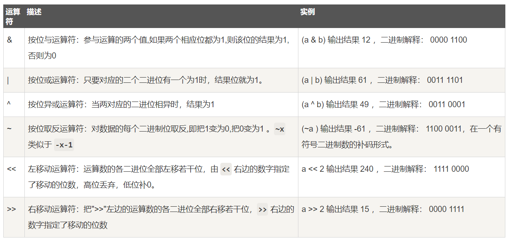

# python学习笔记
<!-- GFM-TOC -->
* [python 优缺点](#python-优缺点)
* [python 参数传递机制](#python参数传递机制)
* [python 数据结构]
	* [python 可变和不可变](#python-可变和不可变)
	* [字符串](#字符串)
	* [列表](#列表)
* [IO 编程](#io-编程)
	* [读取键盘输入](#读取键盘输入)
	* [文件操作](#文件操作)
* [python内置函数](#python内置函数)
* [python初始化问题](#python初始化问题)
* [python数据规范化问题](#python数据规范化问题)
* [python浅拷贝和深拷贝](#python浅拷贝和深拷贝)
* [正则表达式](#正则表达式)
* [位运算](#位运算)
* [变量](#变量)
* [python三大神器](#python三大神器)
	* [装饰器](#装饰器)
	* [生成器](#生成器)
* [函数式编程](#函数式编程)
	* [高阶函数](#高阶函数)
	* [lambda](#lambda)
	* [偏函数](#偏函数)
* [异常处理](#异常处理)
<!-- GFM-TOC -->

## python 优缺点
**优点**：
1. 优雅、明确、简单。易学，能够专注解决问题而不是搞明白语言本身。
2. 开发效率高，有强大的第三方库
3. 可移植性，在多种平台都可以使用
4. 可扩展性，能够将部分程序用 C 写，在 python 中使用
5. 可嵌入性，将 python 嵌入到 C 中，从而向程序用户提供脚本功能

**缺点**：
1. 相比于 C 和 JAVA，运行速度慢
2. 由于 python 开源，代码不能加密
3. python 的 GIL 锁限制并发，线程不能利用多 cpu

### python java c 区别
python 是动态语言，解释型语言，运行速度较慢；在运行期间才做数据类型检查；语法简单，代码量少，类库丰富
java、 c 是静态语言， 数据类型在编译前就需要明确

## python参数传递机制
python 中一切皆对象，任何变量都是对象的引用，python 中参数传递都是**“传对象引用”**的方式，相当于传值和传引用的结合。若收到是可变对象的引用，就能修改对象的原始值，相当于“传引用”； 若收到是不可变对象，就不能直接修改原始对象，相当于“传值”。

- 值传递：存放实参变量的值，被调函数对形参的任何操作都是作为局部变量进行，不影响主调函数的实参变量的值。
- 引用传递：存放实参变量的地址，被调函数对形参的任何操作都影响主调函数中的实参变量。

## python数据结构
### python 可变和不可变
#### 不可变数据类型
变量所指的内存地址的值不可以改变，对其重新赋值其实是重新创建了一个不可变类型的对象，并将原来的变量重新指向新创建的对象（若没有其他变量引用原来的对象，会被回收）。

不可变类型有： number(int、float、bool、complex)、 string、 tuple

python 对 int 和较短的 string 进行了缓存，无论声明多少个值相同的变量，实际上都是指向同一个内存地址； 但两个值相同的 float 的内存地址不同。   
比如 x = 10 和 y = 10， 查看二者的内存地址会发现，id(x) == id(y)； 但若 x += 1 后，内存地址会改变。

值相同的元组的地址可能不同，元组的本质是只读的列表

#### 可变数据类型
变量所指的内存地址处的值是可以改变的，值的变化不会引起新建对象，地址不会改变。

有 list、 set 和 dict， 比如对 a = [1, 2, 3] 进行 append 或 pop， a 的地址不会改变，但若有一个 b = [1, 2, 3] ，a 和 b 的地址是不同的； 若 c = b，此时 b c 的地址相同

### 字符串
#### 1. python str 类型
python 中的 str 类型不能修改，但可以通过切片操作来实现插入、删除和修改操作。  
如 a = '12045'，需要把 '0' 修改为 '3'
```python
a = a[:2] + '3' + a[3:]
```

#### 2. join()
str.join(sequence)用于将序列中的元素以指定的字符连接生成一个新的字符串。经常见到''.join()将列表字典等转化为字符串。  
```python
str = "-";
seq = ("a", "b", "c") # 字符串序列
print(str.join(seq)) # a-b-c
```

#### 3. python 判断字符属于数字、字母还是空格：  
```python
c.isdigit() # 数字
c.isalpha() # 字母
c.isalnum() # 数字和字母
c.isspace() # 空格
```

#### 4. python strip()
str.strip(c) 用于移除字符串首尾指定的字符，不指定 c 则默认为空格或换行符，只要首尾包含有 c 的序列就删除，不管具体的顺序。  
str.lstrip(c) 移除左端指定字符。  
str.rstrip(c) 移除末端指定字符。

#### 5. python split()
str.split(str="", num=string.count(str))
分隔符默认为所有空字符，包括空格，换行\n ，制表符 \t;  num 为分割次数

#### 6. str与bytes
python3 中新增 bytes 类型 by = b'china'; 
- str.encode() 实现 str->bytes
- bytes.decode() 实现 bytes->str

### 列表
#### 1. list 和 set
判断值是否在 set 中的速度比 list 快的多，因此 set 用到 hash 时间复杂度为 O(1)， 而 list 时间复杂度 O(n)  
因此可以将 list 转为 set 来提高查询效率

#### 2. extend 和 append  
```python
list.append(object) # 向列表中添加一个对象 object, 整体打包添加进去
list.extend(sequence) # 把一个序列 seq 的内容添加到列表中
```
```python
a = [1, 2, 3]
b = [4, 5, 6]
a.append(b) # a = [1, 2, 3, [4, 5, 6]]
a.extend(b) # a = [1, 2, 3, 4, 5, 6]
```

#### 3. List index()
```python
list.index(obj) # 用于从列表中找出某个值第一个匹配项的索引位置，没有找到对象则抛出异常。
```

#### 4. sort()和sorted()
[sort()和sorted的区别](https://www.cnblogs.com/jonm/p/8281228.html)
- 内置函数 sort()
sort(fun，key，reverse=False)，可以对列表中的元素进行排序，会改变当前对象。
1. fun： 表明此 sort 函数是基于何种算法进行排序的，一般默认情况下 python 中用的是归并排序，并且一般情况下我们是不会重写此参数的，所以基本可以忽略；
2. key： 用来指定一个函数，此函数在每次元素比较时被调用，此函数代表排序的规则，也就是你按照什么规则对你的序列进行排序；
3. reverse： 用来表明是否逆序，默认的 False 情况下是按照升序的规则进行排序的，当 reverse=True 时，便会按照降序进行排序。

- 全局函数 sorted()
与 sorted 参数一致，对所有可迭代的序列都是适用的，只会返回一个排序后的当前对象的副本，而不会改变当前对象。

如果要自己写比较函数的话，python3 中需要 import functools.cmp_to_key() 方法。
```python
from functools import cmp_to_key

nums = [1, 3, 2, 4]
nums.sort(key=cmp_to_key(lambda a, b: a - b)) # nums = [1, 2, 3, 4]
```
#### 5. 反转
反转List: list.reverse()  
反转字符串: str[::-1]

## IO 编程
在 IO 编程中，输入流 input stream 是数据从磁盘、网络等地方流入内存，输出流是从内存流到外面。  
同步 IO： CPU 等待程序完成，再执行后面的代码； 异步 IO： CPU 不等待磁盘操作

### 读取键盘输入
- raw_input([prompt]): 从标准输入读取一行，并返回这个的字符串； prompt 提示的文字
- input([prompt])： 可以接收一个 python 表达式作为输入，并返回运算结果

### 文件操作
用 with open 方法能够自动调用 close() 方法
```python
with open('filename', 'r', encoding='utf-8') as f:
	f.read() # 一次性读取文件内容，适用于文件较小的情况，过大文件内存不足
	f.readline() # 每次读取一行内容
	f.readlines() # 一次性读取文件内容并按行返回 list，很适用配置文件
	for line in f: # 按行读取，使用大文件
```
- 读取二进制文件，如图片、视频等需要用 'rb' 模式
- 读取非 ASCII 码的文本文件，如 gbk 编码，需要先用二进制模式 'rb' 打开，再用 f.read().decode('gbk')  解码；用 codecs 可以自动转换编码直接独处 unicode
- 在 python3 下可以直接用 open()，是 io 模块提供； 而在 python2 中最好使用 codecs.open() 可以解决一些编码问题。

os.rename(cur_file_name, new_file_name) 重命名 cur
os.remove(file_name) 删除文件

### 目录操作
- os.mkdir("newdir") 创建新目录
- os.chdir("dirname") 改变当前目录
- os.getcwd() 显示当前的工作目录
- os.rmdir('dirname') 删除目录，删除前所有内容应先被清除
- os.path.abspath(path) 返回绝对路径
- os.path.join(path1, path2) 合并路径

- os.walk() 实现文件、目录遍历器，返回三元组(root,dirs,files)
```python
for root, dirs, files in os.walk(dir):
	for file in files: # 遍历文件夹下的所有文件
```

- os.popen(cmd [, mode]) 用于从一个命令打开一个管道，运行 cmd 命令， mode 模式权限默认 'r'，也可以 'w'，可以用 read() 获取执行的输出
- os.system(cmd) 执行 cmd 命令，返回值是脚本运行的状态码，0 是成功


## python内置函数
#### int()和bin()
int() 函数用于将一个字符串或数字转换为整型。 
用法：int(x, base=10)，x 为字符串或数字，base为x进制数，默认十进制。

bin() 返回一个整数 int 或者长整数 long int 的二进制表示。

#### ord()和chr()
chr(i) 返回整数 i 对应的 ascii 字符。
ord(c) 返回字符 c 对应的 ascii 数值。
'A' 的 ascii 为 65， 'a' 的 ascii 为 97，小写字母比大写字母 **大 32**

## python初始化问题
#### 一维数组初始化
```python
nums = [0 for i in range(n)]
```

#### 二维数组初始化
初始化 m 行 n 列的二维数组, 以嵌套循环的方式
```python
nums = [[0 for j in range(n)] for i in range(m)] # 列在前，行在后
```
以 numpy 方式, 调用 zeros 方法
```python
import numpy
nums = numpy.zeros([m, n])
```

#### 无穷大和无穷小
```python
float('inf') #无穷大
-float('inf') #无穷小
```

## python数据规范化问题
#### python 保留小数位    
float('%.2f' % a)  

## python浅拷贝和深拷贝
1. 直接赋值  
在 python 中，对象赋值实际上是对象的引用。当创建一个对象，然后把它赋给另一个变量的时候，python 并没有拷贝这个对象，而只是拷贝了这个对象的引用。  
若原始列表改变，被赋值的 b 也会做相同的改变； 若 b 改变，原始列表也会做相同的改变；即 a 和 b 是同步变化。
```python
a = [1,2,3,["a","b"]]
b = a # b = [1,2,3,["a","b"]]
a.append(4) # b = [1, 2, 3, ['a', 'b'], 4]
```

2. 浅拷贝  
在 copy 模块中，用 copy 函数完成浅拷贝。  
浅拷贝创建一个具有相同类型，相同值但 id 不同的新对象。

注意：对 copy 后的新对象的元素进行修改不会影响原对象，但是若对新对象或原对象中的子对象（即["a", "b"]）进行修改，那么新对象和原对象会同步改变，即对子对象只是引用。

```python
import copy
a = [1,2,3,["a","b"]]
c = copy.copy(a)
a.append(4) # a = [1, 2, 3, ['a', 'b'], 4] b = [1, 2, 3, ['a', 'b']]
c. append(1) # a = [1, 2, 3, ['a', 'b'], 4] b = [1, 2, 3, ['a', 'b'], 1]
a[3].append('c') # a = [1, 2, 3, ['a', 'b', 'c'], 4] b = [1, 2, 3, ['a', 'b', 'c'], 1]
```

3. 深拷贝
在 copy 模块中，用 deepcopy 函数完成深拷贝。  
深拷贝是完全拷贝，包含对象里面的子对象的拷贝，所以原始对象的改变不会造成深拷贝里任何子元素的改变。
```python
import copy
a = [1,2,3,["a","b"]]
c = copy.deepcopy(a)
```

## 位运算
python的位运算符是把数字看作二进制来进行计算的。
```
a = 0011 1100
b = 0000 1101
-----------------
a&b = 0000 1100
a|b = 0011 1101
a^b = 0011 0001
~a  = 1100 0011
```
<div align="center"></div>

## 正则表达式
<div align="center"></div>

#### re.sub
替换字符串中的匹配项 re.sub(pattern, repl, string, count=0) 
repl 为替换的字符串，也可以是一个函数; count 为模式匹配替换的最大次数，默认 0 是替换所有。

#### re.compile
编译正则表达式，生成正则表达式对象，供 match() 和 search() 使用

#### re.match 和 re.search
- re.match(pattern, string, flag=0) flag 为标志位，用于控制正则表达式的匹配方式，如是否区分大小写, 匹配多行等  
从字符串的起始位置（也就是 index=0）开始匹配，若起始位置没有匹配成功就返回 None

- re.search(pattern, string, flag=0)
扫描整个字符串并返回第一个成功的匹配，没有符合的返回 None

#### findall
re.match 和 re.search 都是值匹配一次，而 findall 匹配所有，返回列表形式
```python
import re
pattern = re.compile(r'\d+') # 查找数字
res = pattern.findall(string)
```

#### finditer
与 findall 类似，但将匹配成功的结果作为一个迭代器返回

#### 匹配对象函数
- group(num=0) 匹配的整个表达式的字符串，group() 可以一次输入多个组号，从 1 开始，返回对象是 re.MatchObject
- groups() 返回一个包含所有小组字符串的元组，从 1 开始
- span() 返回匹配成功的位置，起始位置和终止位置

## 变量
#### 星号和双星号
单个星号 * ：该位置接收任意多个非关键字参数，在函数中转化为**元组**(1,2,3,4)
双星号 ** ： 该位置接收任意多个关键字 (key-word) 参数，在函数中转化为**字典**{a=1,b=2}

## python三大神器
### 装饰器
- 装饰器 Decorator 本质上是一个 python 函数，可以让其他函数在不需要任何代码变动的前提下增加额外功能。  
- 装饰器的返回值是一个函数对象，常用场景有：插入日志、性能测试、事务处理、缓存、权限校验等。  
- 装饰器可以抽离出大量与函数本身功能无关的雷同代码并继续重用

```python
import functools

def log(text):
	def wrapper(func):
		@functools.wraps(func)
		def inner_wrapper(*args, **kw): 
			print('%s %s()' %(text, func.__name__))
			return func(*args, **kw) # 可以让其用于任何函数，无论参数形式如何
		return inner_wrapper
	return wrapper
```

### 生成器
生成器 generator 可以实现一边循环一边计算，节省空间，与列表生成式的区别就在于最外层是 [] 还是 ()
```python
l = [x*x for x in range(10)]
g = (x*x for x in range(10))
```

通过函数可以实现复杂逻辑的生成器，当函数中包含 yield 关键字时

### 迭代器
可迭代对象 Iterable： 能够直接作用于 for 循环的对象，如 list、tuple、dict、set、str、generator
迭代器 Iterator： 可以被 next() 函数调用并不断返回下一个值的对象

生成器是 Iterator 对象，但 list、 dict、 str 虽然都是 Iterable，但不是 Iterator， 可以用 iter() 方法将其变成 Iterable 类型。

Python 的 Iterator 对象表示的是一个数据流，Iterator 对象可以被 next() 函数调用并不断返回下一个数据，直到没有数据时抛出 StopIteration 错误。可以把这个数据流看做是一个有序序列甚至是无限大的数据流，只能不断通过 next() 函数实现按需计算下一个数据，所以 Iterator 的计算是惰性的，只有在需要返回下一个数据时它才会计算。

for 循环的本质是不断调用 next()


## 函数式编程
特点： 允许把函数本身作为参数传入另一个函数，还允许返回一个函数
### 高阶函数
把函数作为参数传入，这样的函数称为高阶函数
#### 1. map/reduce
map(function, iterable, ...) 将传入的函数 function 依次作用到序列的每个元素上，并将结果作为新 list 返回。
```python
map(lambda x: x**2, [1,2,3]) # [1,4,9]
map(lambda x, y: x+y, [1,2,3], [4,5,6]) # [5,7,9]
```

reduce(function, iterable[, initializer]) 对参数序列中的元素进行累计，先用 function 计算序列中的 1,2 个元素，得到的结果在和第 3 个元素进行计算。
```python
# 实现将字符串转整数
def char2num(s):
	return {'0':0, '1':1, ...}
def str2int(s):
	return reduce(lambda x,y: x*10+y, map(char2num, s))
```

#### 2. filter
filter(function, iterable)，和 map 用法类似，但用于过滤序列，保留 function 中返回 true 的元素

#### 3. sorted
sorted(iterable[, cmp[, key[, reverse]]])

通常规定 x < y 返回 -1； x==y 返回 0； x > y 返回 1。

- sort() 应用在 list 上，直接对已有的 list 进行排序，无返回
- sorted() 可以对所有可迭代对象进行排序，返回的是新 list

```python
num = [[5,4], [1,6] ,...]
nums = sorted(nums, key=lambda x: (-x[0], x[1])) # 按照第一个元素降序、第二个元素升序规则排序。
```

### lambda
python 中用于创建匿名函数，允许在一行代码中创建一个函数并传递

lambda 一般可以用在 filter，map，reduce，sorted 等函数式编程服务中

- 优点： 代码简洁，适合完成某项简单的功能，且这项功能只在此处用到； 不增加额外变量，可以立刻传递，自动返回结果。
- 缺点： 难理解，降低了可读性和性能。

### 偏函数
functools.partial 帮助创建偏函数，可以创建一个新函数，这个新函数可以固定住原函数的部分参数，使函数能用更少的参数调用，从而调用时更加简单。

## 异常处理
### 常见异常
http://www.runoob.com/python/python-exceptions.html
- BaseException 所有异常的基类
- OverflowError 数值运算超过最大限制
- IOError 输入/输出操作失败
- ImportError 导入模块/对象失败
- RuntimeError 一般运行时错误
- SyntaxError 语法错误

捕捉异常 try/except

try/except语句用来检测try语句块中的错误，从而让except语句捕获异常信息并处理。

如果你不想在异常发生时结束你的程序，只需在try里捕获它。

try-finally 语句无论是否发生异常都将执行最后的代码。

自定义异常： 异常应该是典型的继承自Exception类，通过直接或间接的方式

Python的异常也是class，所有的异常类型都继承自BaseException，

Python中的raise 关键字用于引发一个异常， raise关键字后面是抛出是一个通用的异常类型(Exception)，一般来说抛出的异常越详细越， 主动抛出


