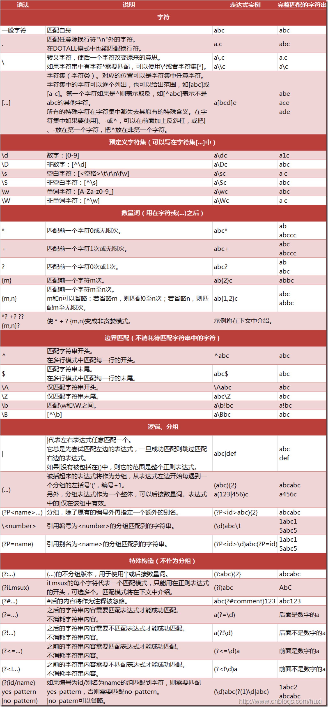

# python学习笔记

python 判断字符属于数字、字母还是空格：  
```
数字：c.isdigit()
字母：c.isalpha()
数字和字母：c.isalnum()
空格：c.isspace()
```

python 保留小数位    
float('%.2f' % a)

### 列表
extend 和 append  
```python
list.append(object) # 向列表中添加一个对象 object, 整体打包添加进去
list.extend(sequence) # 把一个序列 seq 的内容添加到列表中
```
```python
a = [1, 2, 3]
b = [4, 5, 6]
a.append(b) # a = [1, 2, 3, [4, 5, 6]]
a.extend(b) # a = [1, 2, 3, 4, 5, 6]
```

List index()
```python
list.index(obj) # 用于从列表中找出某个值第一个匹配项的索引位置，没有找到对象则抛出异常。
```

反转List: list.reverse()  
反转字符串: str[::-1]

### 正则表达式
<div align="center"></div>
