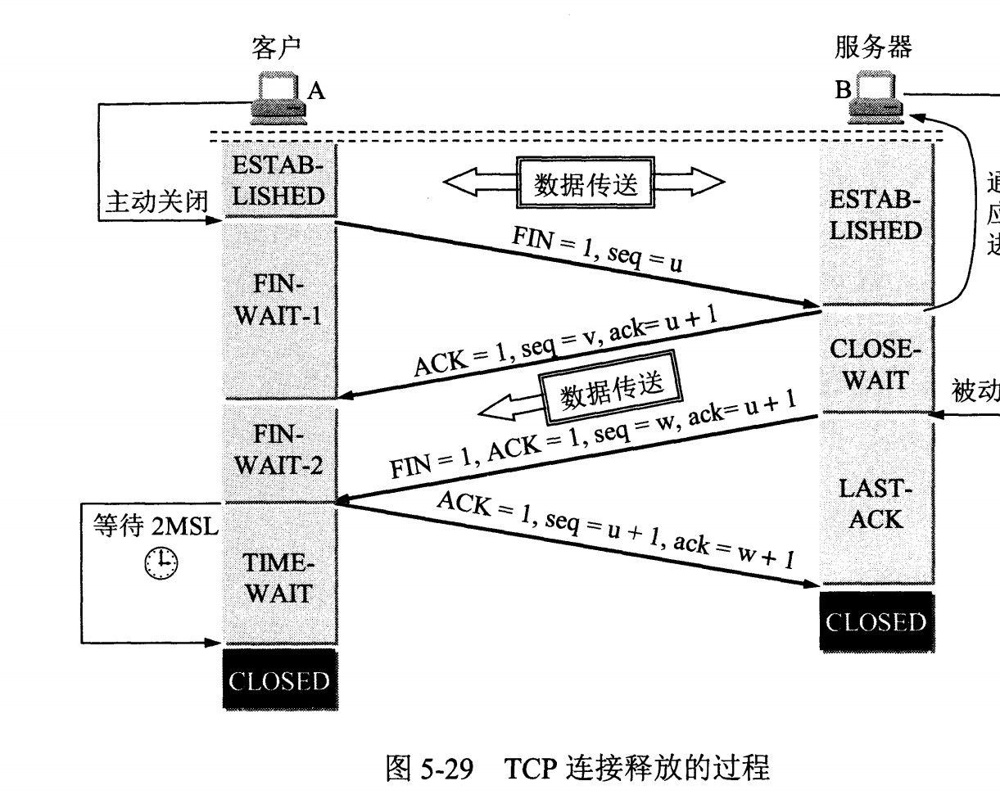

# 计算机网络
<!-- GFM-TOC -->
* [OSI 七层模型](#osi-七层模型)
* [数据链路层](#数据链路层)
	* [PPP 协议](#ppp-协议)
* [网络层](#网络层)
	* [IP 协议](#ip-协议)
	* [ARP 协议](#arp-协议)
	* [ICMP 协议](#icmp-协议)
		* [ping](#ping)
	* [单播、多播、广播](#单播-多播-广播)
* [传输层](#传输层)
	* [TCP 和 UDP](#tcp-和-udp)
	* [TCP 三次握手](#tcp-三次握手)
	* [TCP 四次挥手](#tcp-四次挥手)
	* [TCP 的传输过程](#tcp-的传输过程)
		* [以字节为单位的滑动窗口](#以字节为单位的滑动窗口)
		* [超时重传](#超时重传)
		* [TCP 流量控制](#tcp-流量控制)
		* [TCP 拥塞控制](#tcp-拥塞控制)
* [应用层](#应用层)
	* [Web](#web)
		* [url](#url)
		* [从输入 URL 到浏览器显示页面发生了什么?](#从输入-url-到浏览器显示页面发生了什么)
		* [web 页面空白的原因](#web-页面空白的原因)
	* [DNS](#DNS)
	* [HTTP](#http)
		* [HTTP 首部](#http-首部)
		* [HTTP1.0 和 HTTP1.1 区别](#http1.0-和-http1.1-区别)
		* [HTTP1.X 和 HTTP2.0 区别](#http1.X-和-http2.0-区别)
		* [HTTP 与 HTTPS 区别](#http-与-https-区别)
		* [HTTPS 加密](#https-加密)
		* [GET 和 POST 区别](#get-和-post-区别)
		* [常见状态码](#常见状态码)
		* [HTTP 接口](#http-接口)
		* [抓包](#抓包)
<!-- GFM-TOC -->

## OSI 七层模型
OSI（Open System Interconnect），即开放式系统互联。

1. 物理层： 为数据链路层提供物理连接，在其上串行传送比特流，即所传送数据的单位是比特。物理层使用的中间设备是转发器。

2. 数据链路层： 定义了如何让格式化数据以进行传输，以及如何让控制对物理介质的访问，这一层通常还提供错误检测和纠正，以确保数据的可靠传输。 有 PPP、STP、CSMA/CD、交换机(二层)、网桥、适配器、ARP

3. 网络层： 网络层负责在源机器和目标机器之间建立它们所使用的路由。IP、ICMP、ARP、路由器

4. 传输层：建立、管理和维护端到端的连接，保证数据有效到达对端。TCP、UDP

5. 会话层：负责在网络中的两节点之间建立、维持和终止通信。 功能：建立通信链接，保持会话过程通信链接的畅通，同步两个节点之间的对话，决定通信是否被中断以及通信中断时决定从何处重新发送。

6. 表示层：数据格式转化和数据加密，是应用程序和网络之间的翻译官，确保一个系统的应用层所发送的信息可以被另一个系统的应用层读取。

7. 应用层：为用户的应用程序（例如电子邮件、文件传输和终端仿真）提供网络服务。 DNS、FTP、WWW、HTTP、SMTP、TELNET

## 数据链路层
定义了如何让格式化数据以进行传输，以及如何让控制对物理介质的访问，这一层通常还提供错误检测和纠正，以确保数据的可靠传输。 有 PPP、STP、CSMA/CD、交换机(二层)、网桥、适配器、ARP

### PPP 协议
互联网用户通常需要连接到某个 ISP 之后才能接入到互联网，PPP 协议是用户计算机和 ISP 进行通信时所使用的数据链路层协议。

## 网络层
### IP 协议
IP 网际协议，IP 地址是 IP 协议提供的一种统一的地址格式，为互联网上的每个网络和每台主机分配一个逻辑地址，使用 IP 协议可以把异构的物理网络连接起来。分为 IPv4 和 IPv6 两种。

与 IP 配套使用的协议： ARP、 ICMP、 IGMP

IP 协议是一种无连接的，不可靠的数据包协议，它并不能保证数据一定被送达，保证数据送到就需要通过 ICMP 协助实现。
IP 数据报的源地址和目的地址始终不变，而 MAC 地址随着链路的改变而改变。

### ARP 协议
ARP 地址解析协议，是根据 IP 地址获取物理地址（MAC）的一个 TCP/IP 协议。

每个主机都有一个 ARP 高速缓存，里面有本局域网上的各主机和路由器的 IP 地址到 MAC 地址的映射表。

如果主机 A 知道主机 B 的 IP 地址，但是 ARP 高速缓存中没有该 IP 地址到 MAC 地址的映射，此时主机 A 通过广播的方式发送 ARP 请求分组，主机 B 收到该请求后会发送 ARP 响应分组给主机 A 告知其 MAC 地址，随后主机 A 向其高速缓存中写入主机 B 的 IP 地址到 MAC 地址的映射。

注意： 在 OSI 模型中 ARP 协议属于链路层；而在 TCP/IP 模型中，ARP 属于网络层。 

### ICMP 协议
ICMP 网际控制报文协议，是为了更有效地转发 IP 数据报和提高交付成功的机会，ICMP 报文封装在 IP 数据报中。

ICMP 协议分类：
1. 查询报文类型：ping查询、子网掩码查询、时间戳查询等
2. 差错报文类型：主要产生于当数据传送发送错误的时候，Linux 下的 Traceroute 指令使用 ICMP 的差错报文可以实现遍历到数据包传输路径上的所有路由器

#### ping
ping 是 ICMP 的一个重要应用，主要用来测试两台主机之间网络的连通性。

Ping 的原理：通过向目的主机发送 ICMP Echo 请求报文，目的主机收到之后会发送 Echo 回答报文。Ping 会根据时间和成功响应的次数估算出数据包往返时间以及丢包率。

1. 在主机 A 上 ping 主机 B 的 ip 地址，ping 命令会在 A 上构建一个 ICMP 的请求包，ICMP 将数据包和目标 IP 等信息交给 IP 层协议
2. IP 层协议得到这些信息后，将本机IP、目标IP、和一些其它的控制信息，构建成一个 IP 数据包
3. 通过 ARP 映射表找出目标 IP 所对应的 MAC 地址，交给数据链路层，组装成一个数据帧，依据以太网的介质访问规则，将它们传送出出去
4. B收到数据帧后，首先检查它的目标 MAC 地址是不是本机，是就接收并处理，检查数据帧，将数据帧中的 IP 数据包取出来，交给本机的 IP 层协议；IP层协议检查完后，再将 ICMP 数据包取出来交给 ICMP 协议处理，最后构建一个 ICMP 应答数据包，回发给主机 A
5. 在一定的时间内，A 收到了应答包，则说明它与 B 之间网络可达，如果没有收到，则说明网络不可达。除了监测是否可达以外，还可以利用应答时间和发起时间之间的差值，计算出数据包的延迟耗时。

### 单播、多播、广播
#### 单播
主机之间“一对一”的通讯模式，网络中的交换机和路由器对数据只进行转发不进行复制。但能针对每个客户及时响应，因此网页浏览采用 IP 单播协议。网络中的路由器和交换机根据其目标地址选择传输路径，将 IP 单播数据传送到其指定的目的地。

优点： 服务器能及时响应客户请求，能针对不同客户不同请求发送不同数据，实现个性化服务  
缺点：在客户数量大、每个客户机流量大的流媒体应用中服务器不堪重负。

#### 广播
主机之间“一对所有”的通讯模式，网络对其中每台主机发出的信号都进行无条件复制并转发，所有主机都可以接收到所有信息。 ARP 协议利用广播，广播禁止在Internet宽带网上传输。

优点： 网络设备简单，维护简单，布网成本低廉；服务器流量负载极低  
缺点： 无法针对每个客户的要求和时间及时提供个性化服务

#### 多播/组播
介于单播和广播之间，主机之间“一对一组”的通讯模式，加入了同一个组的主机可以接受到此组内的所有数据，网络中的交换机和路由器只向**有需求者**复制并转发其所需数据。

优点： 节省了服务器的负载，提供的服务可以非常丰富，允许在Internet宽带网上传输  
缺点： 与单播协议相比没有纠错机制，发生丢包错包后难以弥补，但可以通过一定的容错机制和 QOS 加以弥补。

使用 IGMP 网际组管理协议，使多播 ip 数据报跨网络传播。

## 传输层
### TCP 和 UDP
- **TCP 传输控制协议：** 面向连接，提供可靠交付，有流量控制、拥塞控制，通过字节流传输，有窗口大小限制，太长的话会被拆分进行发送

- **UDP 用户数据包协议：** 无连接，尽可能最大交付，不可靠，没有拥塞控制，通过报文传输，无论交给 UDP 多长的报文都会一次性发送，会保留报文的边界，不合并不拆分

#### TCP 和 UDP 区别
1. TCP 发送数据前需要建立连接； UDP 不需要
2. TCP 更可靠、稳定，但是效率较低，有延时，占用系统资源高； UDP 传输速度快，但不可靠、不稳定，可能丢包
3. 对网络通信质量有要求，数据准确时用 TCP，如浏览器、邮箱等； 不高、要求快用 UDP，如 QQ语音、视频
4. **本质区别： TCP 面向字节流，UDP 面向报文**： TCP 把应用层传下来的报文看做字节流，把字节流组织成大小不等的数据块； UDP 对应用程序传下来的报文不合并也不拆分，只是添加 UDP 首部。
5. ，每一条 TCP 连接只能是点对点的（一对一）；而 UDP 支持一对一、一对多、多对一和多对多的交互通信。

#### 使用 TCP 和 UDP 的协议
TCP 对应的协议：
1. FTP 文件传输协议
2. TELNET 用于远程登陆的端口
3. SMTP 邮件传输协议，用于发送邮件
4. POP3 用于接收邮件
5. HTTP

UDP 对应的协议：
1. DNS
2. SNMP 简单网络管理协议。 由于网络设备很多，无连接的服务就体现出其优势。
3. TFTP 简单文件传输协议

#### TCP 长连接和短连接
##### TCP 长连接
长连接是在一个 TCP 连接上可以连续发送多个数据包。  
长连接在没有数据通信时，定时发送数据包(心跳)，以维持连接状态。

优点： 省去较多的 TCP 建立和关闭的操作，减少浪费，节约时间。 适用于频繁请求资源的用户。  
过程： 连接 -> 数据传输 -> 保持连接(心跳) -> 数据传输 -> 保持连接(心跳) -> ... -> 关闭连接  
应用场景： 操作频繁（读写），点对点的通讯，而且连接数不能太多情况

##### TCP 短连接
短连接是通信双方有数据交互时，就建立一个 TCP 连接，数据发送完成后，断开此 TCP 连接

优点： 管理起来比较简单，存在的连接都是有用的连接，不需要额外的控制手段。  
过程： 连接 -> 数据传输 -> 关闭连接  
应用场景： WEB 网站的 http 服务（HTTP1.0 只支持短连接）

#### UDP 如何实现可靠连接
UDP 在传输层无法保证数据的可靠传输，可以在应用层实现一些保证可靠传输的机制。  
最简单的方法： 在应用层模拟 TCP 的可靠性传输  
1. 添加应答确认 seq/ack 机制，确保数据发送到对端
2. 添加发送和接收缓冲区，实现用户超时重传
3. 添加超时重传机制

开源的 UDP 可靠传输机制： UDT，UDT建于UDP之上，并引入新的拥塞控制和数据可靠性控制机制

### TCP 报文
- **序号 seq** ：占 4 个字节，用于对字节流进行顺序编号，首部中的序号值是本报文段所发送的数据的第一个字节的序号。例如序号为 301，表示第一个字节的编号为 301，如果携带的数据长度为 100 字节，那么下一个报文段的序号应为 401。

- **确认号 ack** ：期望收到的下一个报文段的第一个数据字节的序号。例如 B 正确收到 A 发送来的一个报文段，序号为 501，携带的数据长度为 200 字节，因此 B 期望下一个报文段的序号为 701，B 发送给 A 的确认报文段中确认号就为 701。 若确认号为 N ，则说明到 0到N-1 的所有数据都已经正确接收。

控制位说明报文段的性质：
- **确认 ACK** ：当 ACK=1 时确认号字段有效，否则无效。TCP 规定，在连接建立后所有传送的报文段都必须把 ACK 置 1。

- **同步 SYN** ：在连接建立时用来同步序号。当 SYN=1，ACK=0 时表示这是一个连接请求报文段。若对方同意建立连接，则响应报文中 SYN=1，ACK=1。

- **终止 FIN** ：用来释放一个连接，当 FIN=1 时，表示此报文段的发送方的数据已发送完毕，并要求释放连接。

- 紧急 URG、 推送 PSH、 复位 RST

### TCP 三次握手

 

1. 首先服务器 B 处于 LISTEN（监听）状态，等待客户端 A 的连接请求
2. 客户端向服务器发送连接请求报文段，带有 SYN=1, ACK=0 标志的报文段，选择初始序号 seq=x
3. 服务器收到请求，若同意建立连接，则向客户端发送连接确认报文段，SYN=1, ACK=1, 确认号 ack=x+1，同时也选择一个初始序号 seq=y
4. 客户端收到服务器的连接确认报文段，再向服务器发出确认，ACK=1，同时确认号 ack=y+1
5. 服务器收到客户端的确认后，建立连接

#### 三次握手的原因
第三次握手的原因： 为了防止已失效的连接请求到达服务器，让服务器错误打开连接。

客户端发送的连接请求如果在网络中滞留，那么就会隔很长一段时间才能收到服务器端发回的连接确认。客户端等待一个超时重传时间之后，就会重新请求连接。但是这个滞留的连接请求最后还是会到达服务器，如果不进行三次握手，那么服务器就会打开两个连接，服务端就会等待客户端发数据，但客户端此时并没有请求建立连接，就不会发数据，服务端资源产生了浪费。  
如果有第三次握手，客户端会知道之前已经发过了，忽略服务器之后发送的对滞留连接请求的连接确认，不进行第三次握手，因此就不会再次打开连接。

### TCP 四次挥手

 

1. 客户端发送连接释放报文段，FIN=1
2. 服务器收到后发出确认，ACK=1，此时 TCP 属于半关闭状态，服务器能够向客户端发送数据，但客户端不能向服务器发送数据
3. 当服务器不需要连接时，向客户端发送连接释放报文段， FIN=1
4. 客户端收到后发出确认，ACK=1，客户端进入 TIME-WAIT 状态，等待 2MSL 后连接释放

客户端收到服务器的 FIN 报文后，进入 TIME-WAIT 状态，而不是直接 CLOSED，原因为：
1. 确保最后一个确认报文段能够到达，这个报文段有可能丢失，那么服务器没收到客户端发送的确认报文段，服务器就重传这个报文段
2. 等待一段时间是为了防止“已失效的连接请求报文段”出现在本连接中，使得下一个新的连接不会出现旧的连接请求报文。

#### 四次挥手的原因
确保数据能够完成传输。

TCP 释放连接是单向释放，A 没有数据发给 B 了，A 就向 B 发出连接释放报文段，然后停止发送数据，发送确认是两次握手；
而 B 可能还要向 A 发送数据，B 到 A 的连接没有关闭，因此当 B 不需要发送数据后，就再向 A 发出连接释放。

### TCP 的传输过程
- 确认号ack：期望收到的下一个报文段序号
- 确认ACK： 当 ACK=1 时确认号字段才有效
- 同步SYN： 连接建立时用来同步序号； SYN=1,ACK=0 为连接请求报文段； SYN=1,ACK=1 同意连接的响应报文
- 终止FIN： 用于释放连接

#### 以字节为单位的滑动窗口
接收窗口只会对窗口内最后一个**按序到达**的字节进行确认，知道这个字节前的所有字节都已经被接收

#### 超时重传
TCP 可靠传输靠超时重传实现，若一个已经发送的报文段在超时时间内没有收到确认，就重传这个报文段。

#### TCP 流量控制
控制发送方的发送速率，保证接收方来得及接收。

接收方发送的确认报文中的窗口字段可以用来控制发送方窗口大小，发送方根据这个来设置自己的窗口大小。若为 0，则发送方不能发送数据。

#### TCP 拥塞控制
- TCP 流量控制： 为了让接收方来得及接收
- TCP 拥塞控制： 为了降低整个网络的拥塞程度，防止注入过多的数据到网络中

四种方法： 慢开始、拥塞避免、快重传、快恢复

发送方需要维护一个 拥塞窗口 cwnd 的状态变量，大小取决于网络拥塞程度，并动态变化。

#### 1. 慢开始与拥塞避免

  

慢开始： 由小到大逐渐增大发送窗口，也就是拥塞窗口的数值。 
- 从 cwnd=1（1 个报文段）开始发送
- 收到确认后，将 cwnd 翻倍，每次 * 2，之后能够发送的报文段数量为 2, 4, 8 ...

拥塞避免：
- 为了防止 cwnd 增长过大引起的网络拥塞，设置一个慢开始门限 ssthresh，当 cwmd >= ssthresh 时，进入拥塞避免，每次只将 cwnd+1
- 如果出现超时，则 ssthresh = cwnd / 2, 然后重新执行慢开始，重置 cwnd = 1

#### 2. 快重传与快恢复

连续收到三个重复确认，则执行快重传； 然后将 ssthresh = cwnd / 2 执行快恢复

在接收方，要求每次接收到报文段都应该对最后一个已收到的有序报文段进行确认。例如已经接收到 M1 和 M2，此时收到 M4，应当发送对 M2 的确认。

在发送方，如果收到三个重复确认，那么可以知道下一个报文段丢失，此时执行快重传，立即重传下一个报文段。例如收到三个 M2，则 M3 丢失，立即重传 M3。

在这种情况下，只是丢失个别报文段，而不是网络拥塞。因此执行快恢复，令 ssthresh = cwnd / 2 ，cwnd = ssthresh，注意到此时直接进入拥塞避免。

慢开始和快恢复的快慢指的是 cwnd 的设定值，而不是 cwnd 的增长速率。慢开始 cwnd 设定为 1，而快恢复 cwnd 设定为 ssthresh。

  
 

## 应用层
### Web
#### URL
URL 统一资源定位符，由三部分组成：
1. 协议类型：http、https、ftp、gopher、telnet、file
2. 主机名、端口号，默认 80
3. 路径及文件名
4. 参数、 查询: `https://www.baidu.com/s?wd=url&rsv_spt=1`

注意 URI 是通用资源标识符，URL 是 URI 的子集，URI 强调资源标识，URL 强调资源定位。

#### 从输入 URL 到浏览器显示页面发生了什么
可以分为两个阶段，网络通信和页面渲染。  

网络通信：  
1. 应用层 DNS 解析域名，找到对应的 IP 地址。 先本地再请求上级 DNS 服务器
2. 应用层客户端发送 HTTP 请求
3. 传输层 TCP 传输报文，HTTP 是包裹在 TCP 报文之中  
三次握手： SYN, ACK/SYN, SYN  
四次分手： FIN, ACK, FIN, ACK  
4. 网络层 IP 协议查询 MAC 地址：  IP 协议的作用是把 TCP 分割好的各种数据包传送给接收方。而要保证确实能传到接收方还需要接收方的 MAC 地址，也就是物理地址。IP 地址和 MAC 地址是一一对应的，一个网络设备的 IP 地址可以更换，但是 MAC 地址一般固定不变。ARP 协议可以将 IP 地址解析成对应的 MAC 地址。当通信的双方不在同一个局域网时，需要多次中转才能到达最终的目标，在中转的过程中需要通过下一个中转站的 MAC 地址来搜索下一个中转目标。
5. 数据到达数据链路层。 客户端发送请求完成
6. 服务器接受数据，处理请求并返回 HTTP 报文。 状态码 200 表示成功， 301 重定向， 400 not found
7. 页面渲染

#### web 页面空白的原因
web 页面加载不出来：网络断开、DNS 无法解析网址、服务器负载过大， 注意网络问题不会导致白屏

web 页面空白： JS 语法错误（打开控制台查看报错信息、查看接口访问是否有请求）、服务器问题

### DNS
DNS 域名系统，是一个分布式数据库，提供了主机名和 IP 地址之间相互转换的服务。
域名具有层次结构，从上到下依次为：根域名、顶级域名、二级域名。

#### DNS 用的什么协议？
DNS 占用 53 号端口，同时使用 TCP 和 UDP 协议。  
1. DNS 区域传输使用 TCP 协议，需要进行数据同步，TCP 是可靠连接，可以保证数据的准确性  
2. 域名解析使用 UDP 协议，DNS 服务器负载低，响应快

大多数情况下 DNS 使用 UDP 进行传输，这就要求域名解析器和域名服务器都必须自己处理超时和重传从而保证可靠性

在两种情况下会使用 TCP 进行传输：
- 如果返回的响应超过的 512 字节（UDP 最大只支持 512 字节的数据）。
- 区域传送（区域传送是主域名服务器向辅助域名服务器传送变化的那部分数据）。

#### 域名解析过程
1. 本地 DNS 服务器收到 DNS 请求后，先查询自己的缓存记录，如果有，直接返回对应的 IP 地址，没有，则请求 DNS 根服务器
2. 根服务器不记录具体域名与 IP 地址的对应关系，会告诉本地 DNS 服务器，可以到域服务器上查询，并给出地址
3. 本地 DNS 服务器向域服务器发起请求，如果有则返回，没有就会返回下级的域名服务器的地址
4. 重复第 3 步，一直返回下级地址，直到找到为止
5. 本地 DNS 服务器把接收到的 IP 地址与域名对应关系保存到缓存中，并且向客户端返回结果

### HTTP
HTTP 请求报文包括 3 个部分： HTTP 请求行、请求头部、请求体
请求行包括：请求方法字段、URL字段、HTTP协议版本字段。它们用空格分隔。例如，GET /index.html HTTP/1.1。
请求头部: 由关键字/值对组成
请求体: post put等请求携带的数据

HTTP 响应报文包括 3 个部分： HTTP 响应行、响应头部、响应体
响应行： 由协议版本，状态码和状态码的原因短语组成，例如HTTP/1.1 200 OK。
响应头：由关键字/值对组成
响应体：服务器响应的数据

#### HTTP 首部
有 4 种类型的首部字段：通用首部字段、请求首部字段、响应首部字段和实体首部字段。

##### 通用首部字段（请求报文与响应报文都会使用的首部字段）
Date：创建报文时间
Connection：连接的管理
Cache-Control：缓存的控制
Transfer-Encoding：报文主体的传输编码方式

##### 请求首部字段（请求报文会使用的首部字段）
User-Agent：产生请求的浏览器类型
Host：请求资源所在服务器
Accept：可处理的媒体类型
Range 实体的字节范围请求 
Authorization web的认证信息 
If-Match 比较实体标记

##### 响应首部字段（响应报文会使用的首部字段）
Accept-Ranges：可接受的字节范围
Location：令客户端重新定向到的 URI
Server：HTTP 服务器信息

##### 实体首部字段（请求报文与响应报文的的实体部分使用的首部字段）
Allow：资源可支持的HTTP方法
Last-Modified 资源最后的修改资源
Expires 实体主体的过期资源 

#### HTTP1.0 和 HTTP1.1 区别
1. 缓存处理： HTTP1.1 有多种缓存控制策略
2. 带宽优化及网络连接的使用： HTTP1.1 在请求头引入 range 头域，允许只请求资源的部分，返回码是 206 Partial Content，能够充分利用带宽和连接
3. Host 头处理： HTTP1.0 没有传递主机名，HTTP1.1 的请求消息和响应消息都应支持 Host 头域
4. 长连接： HTTP1.1 支持长连接，一个 TCP 连接可以传送多个 HTTP 请求和响应，减少了建立和关闭连接的消耗和延迟，而 HTTP1.0 每次请求都要创建连接
5. 错误通知的管理： 新增状态码

#### HTTP1.X 和 HTTP2.0 区别
HTTP1.X 需要多个连接才能实现并发和缩短延迟，而 HTTP2.0 比 HTTP1.X 大幅度提升了 web 性能。
**1. 多路复用**
允许单一的 HTTP/2 连接同时发起多重的请求-响应消息，HTTP1.X 只能顺序执行，回复后再请求下一个资源。 
实现多路复用： 二进制分帧，HTTP2.0 将报文分成 HEADERS 帧和 DATA 帧，它们都是二进制格式的。来自不同数据流的帧可以交错发送，然后再根据每个帧头的数据流标识符重新组装，这样就能保证接收到的资源都是正确的。

HTTP2 通过让所有数据流共用同一个连接，可以更有效地使用 TCP 连接，让高带宽也能真正的服务于 HTTP 的性能提升

**2. 首部压缩** 
HTTP1.X 的头部带有大量信息，没有经过压缩，而且每次都要重复发送，给网络带来额外的负担。
HTTP2.0 在客户端和服务器同时维护和更新一个包含之前见过的首部字段表，从而避免了重复传输。且使用 Huffman 编码对首部字段进行压缩。

**3. 服务器推送**
服务端推送是一种在客户端请求之前发送数据的机制。 
HTTP2.0 在客户端请求一个资源时，会把相关的资源一起发送给客户端，客户端之后就不需要再次发起请求了。

#### HTTP 与 HTTPS 区别
HTTP 以明文方式发送内容，不提供数据加密，不适合传输敏感信息。  
HTTPS 是在 HTTP 的基础上加入 SSL 协议，依靠证书验证身份，为浏览器与服务器之间的通信加密。
1. HTTP 是明文传输，HTTPS 是具有安全性的 SSL 加密传输协议
2. HTTP 与 HTTPS 的连接方式和用到的端口号不同，HTTP 是 80，HTTPS 是 443
3. HTTP 连接简单，无状态；HTTPS 需要申请证书进行身份认证，更安全

#### HTTPS 的验证流程
1. 客户端发起一个 http 请求，连接到服务器的 443 端口。
2. 服务端把自己的信息以数字证书的形式返回给客户端，证书中有一个公钥来加密信息，私钥由服务器持有。
3. 客户端收到服务器的响应后验证证书的合法性
4. 生成随机密码（RSA签名）:验证通过，或用户接受了不受信任的证书，浏览器生成一串随机字符串，让服务端用私钥加密随机字符串，返回结果后客户端再用公钥解密。若与之前的随机字符串一致，则说明服务端确实是私钥的持有者。
5. 验证完服务端身份后，客户端生成一个对称加密的算法和对应密钥，以公钥加密之后发送给服务端。之后客户端与服务端可以用这个对称加密算法来加密和解密通信内容了。

##### 加密技术
明文：HTTP协议是明文传输的，明文就是未被加密过的原始数据。  
密钥： 通常是一个字符串或数字，进行加密/解密算法时使用。公钥和私钥都是密钥，一般公钥是对外开放的，加密时使用；私钥是不公开的，解密时使用。

1. 非对称加密算法（公钥加密）：RSA、DSA/DSS、Elgamal、Rabin、D-H、ECC等。加密和解密使用不同的密钥
客户端与服务器相互验证的过程中用的就是非对称加密算法。
RSA密码体制就是公钥密码体制，RSA的一对公钥和私钥都可以用来加密和解密。

2. 对称加密算法（私钥加密）： AES、DES、3DES、TDEA、Blowfish、RC4、RC5、IDEA等。加密和解密使用同一密钥。
由于加密算法是公开的，若要保证安全性，密钥不能对外公开。通常用来加密消息体。

3. HASH算法： MD5，SHA1，SHA256。用来确认信息没有被篡改，主要用来生成签名。

4. 数字证书： 主要包含证书发布机构，证书有效期，公钥，证书所有者，签名使用的算法，指纹以及指纹算法。数字证书可以保证里面的公钥一定是证书持有者的。

#### GET 和 POST 区别

**GET 和 POST 本质上没有区别，都是 TCP 连接**  
但由于 HTTP 的规定和浏览器/服务器的限制，其在应用中会体现出一些不同。

使用： GET 主要是从指定的资源请求数据， POST 是向指定的资源提交要被处理的数据。

1. 参数方面：
get 参数一查询字符串出现在 url 中，通过 url 传递，且长度有限制； post 参数存储在内容实体 request body 中，长度无限制。

2. 安全性方面：   
从传输数据角度看，post 比 get 更安全，因为 get 的参数在 url 中是可见的，不能用于传递隐私信息， 而 post 在内容实体里，不可见。   
从服务端角度看，get 是安全方法（安全的 HTTP 方法不会改变服务器状态，也就是说它只是可读的。）
因为 get 不会改变服务端数据，而 post 能上传表单数据，可以修改数据库，服务端状态发生了改变。

3. 字符编码方面：  
get 请求只能进行 url 编码（汉字需要编码），而 post 支持多种编码方式。  
对于参数的数据类型，get 只支持 ASCII 字符，中文可能会乱码； post 支持标准字符集。

4. 发送数据包方面：  
get 产生 1 个 TCP 数据包；post 产生 2 个 TCP 数据包。  
get 方式的请求，浏览器会把 http header 和 data 一并发送出去，服务器响应 200； post 的话浏览器先发送 header，服务器响应 100 continue，浏览器再发送 data，服务器响应 200 ok。

#### PUT
PUT 请求方法使用请求中的负载创建或者替换目标资源。 传输文件。 

PUT 与 POST 方法的区别在于，PUT 方法是幂等的：调用一次与连续调用多次是等价的（即没有副作用），
而连续调用多次 POST 方法可能会有副作用，比如将一个订单重复提交多次。

PUT 和 POST 本质上没有区别，是规范和语义方面的不同，都是 socket 基于 tcp/ip 协议完成数据传递然后根据不同的规则处理，都可以用于更新和新建请求

#### DELETE 
请求源服务器删除指定的资源

#### 常见状态码
##### 1. 1XX 信息性状态码：接收的请求正在处理
- 100 Continue ：表明到目前为止都很正常，客户端可以继续发送请求或者忽略这个响应。

##### 2. 2XX 成功状态码： 请求正常处理完毕
- 200 OK
- 204 No Content ：请求已经成功处理，但是返回的响应报文不包含实体的主体部分。一般在只需要从客户端往服务器发送信息，而不需要返回数据时使用。
- 206 Partial Content ：	部分内容， 服务器成功处理了部分 GET 请求。

##### 3. 3XX 重定向状态码：需要进行附加操作以完成请求
- 301 Moved Permanently ：永久性重定向
- 302 Found ：临时性重定向
- 303 See Other ：和 302 有着相同的功能，但是 303 明确要求客户端应该采用 GET 方法获取资源。
注：虽然 HTTP 协议规定 301、302 状态下重定向时不允许把 POST 方法改成 GET 方法，但是大多数浏览器都会在 301、302 和 303 状态下的重定向把 POST 方法改成 GET 方法。
- 304 Not Modified ：如果请求报文首部包含一些条件，例如：If-Match，If-Modified-Since，If-None-Match，If-Range，If-Unmodified-Since，如果不满足条件，则服务器会返回 304 状态码。
- 307 Temporary Redirect ：临时重定向，与 302 的含义类似，但是要求是 POST 方法。

##### 4. 4XX	客户端错误状态码： 服务器无法处理请求
- 400 Bad Request ：请求报文中存在语法错误。
- 401 Unauthorized ：请求要求用户的身份认证。
- 403 Forbidden ：服务器理解请求客户端的请求，但是拒绝执行此请求。
- 404 Not Found： 请求的资源不存在

##### 5. 5XX	服务器错误状态码: 服务器处理请求出错
- 500 Internal Server Error ：服务器内部错误，无法完成请求。
- 502 Bad Gateway： 作为网关或者代理工作的服务器尝试执行请求时，从远程服务器接收到了一个无效的响应
- 503 Service Unavailable ：服务器暂时处于超负载或正在进行停机维护，现在无法处理请求。
- 504 Gateway Time-out： 充当网关或代理的服务器，未及时从远端服务器获取请求

#### HTTP 接口
http 接口是一种基于 http 服务的 api，是系统之间交互的一种约定。可以看做一个传递数据的通道。

HTTP API 接口： 走 HTTP 协议，通过路径区分调用方式，请求报文为 key-value 形式，返回报文为 json 串； 有 post 和 get 等方法，可以用 postman、RESTClient、jmeter、loadrunner 等工具测试

#### 抓包
抓包：是将网络传输发送与接收的数据包进行截获、重发、编辑、转存等操作，可以用来检查网络安全、进行数据截取等。

##### fiddler 抓包
Fiddler 通过改写 HTTP 代理，让数据从它那通过，来监控并且截取到数据。打开 fiddler 会自动设置代理，关闭会还原代理。

fiddler怎么抓 HTTPS 包：在 fiddler 的设置中需要勾选一些 HTTPS 相关的选项，需要下载安全证书
手机端：保证手机和电脑处于一个局域网中，配置网络代理，填写电脑的 IP 地址和 fiddler 的代理端口号，并下载安装 fiddler 证书

#### cookie 和 session
HTTP 协议是无状态的。一旦数据交换完毕，客户端与服务器端的连接就会关闭，再次交换数据需要建立新的连接。因此服务器无法从连接上跟踪会话，session 和 cookie 就是常用的会话跟踪技术。

cookie： 为了识别用户身份，进行 session 跟踪而存储在用户本地中的数据，属于客户端技术。
session： Session 对象存储特定用户会话所需的属性及配置信息

区别：
1. cookie 数据存在客户端，session 数据存在服务端
2. cookie 数据大小有限制，且浏览器对每个站点的 cookie 个数有限制；
   session 没有大小限制，和服务器的内存大小有关。
3. cookie 有安全隐患，通过拦截或本地文件找得到你的 cookie 后可以进行攻击; 而 session 保存在服务端，相对更安全
4. Session 是保存在服务器端上会存在一段时间才会消失，如果 session 过多会增加服务器的压力

联系： session 基于 cookie 技术， 客户端 Session 默认是以 cookie 的形式来存储的

### 代理服务器
代理服务器 Proxy Server ： 是代理网络用户去取得网络信息，是一种网络信息的中转站。用于处理内部网络访问外部网络问题

VPN 是代理服务器的一种形式，是一种虚拟出来的企业内部专线，通过在公用网络上建立专线网络，来进行加密通讯。用于解决外部网络访问内部网络问题。

## 其他
### CDN
CDN 是内容分发网络，使用户就近获取所需内容，降低网络拥塞，提高用户访问响应速度和命中率。
CDN 的关键技术主要有内容存储和分发技术。

给一个IP地址如何找到它的主机??? 什么意思？？？

【参考文献】
[谈谈HTTP1.0,HTTP1.1和HTTP2.0区别](https://segmentfault.com/a/1190000016496448)  
[让面试官膜拜你的HTTPS运行流程（超详细）](https://zhuanlan.zhihu.com/p/60033345)